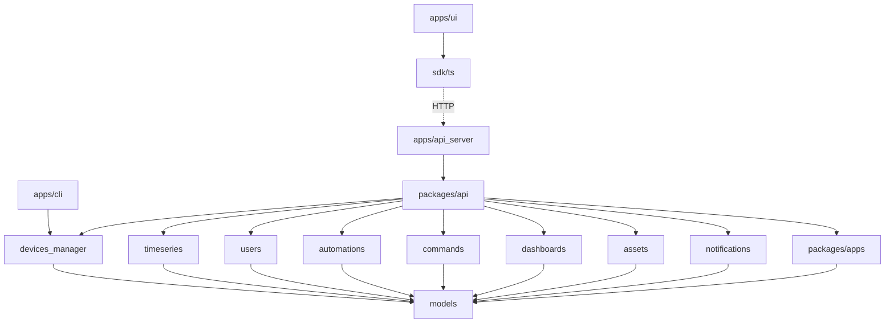

# Contributing to Gridone

## Dev setup

### Installation

This project is managed with [uv](https://docs.astral.sh/uv/) using `workspaces`. Run

```sh
uv sync --all-packages
```

to create a virtual environment and install all project dependencies.

The `apps/ui` frontend has its own dependencies, installed separately:

```sh
cd apps/ui
npm install
```

### Tooling

Gridone uses [astral.sh](https://astral.sh) python development tools:
- [ruff](https://docs.astral.sh/ruff/) for linting and formatting,
- [ty](https://docs.astral.sh/ty/) for type checking,

See astral's documentation for IDE integration.

Along with [pytest](https://docs.pytest.org/en/stable/) for tests.

```sh
uv run ruff check # linting
uv run ruff format # formatting
uv run ruff format --check # format check
uv run ty check # type check
uv run pytest # runs all tests
uv run pytest -m "not integration" # run unit tests
uv run pytest -m integration # run integration tests
```

The `apps/ui` project uses eslint, prettier, typescript and vitest — see [`apps/ui/README.md`](apps/ui/README.md).

### Git hooks (recommended)

This project uses [prek](https://prek.j178.dev/) to manage git hooks. Install prek, then run:
```sh
prek install -t commit-msg -t pre-commit -t pre-push
```

This sets up:
- **Commit-msg**: [conventional commits](https://www.conventionalcommits.org/) enforcement
- **Pre-commit**: ruff check, ruff format check, import contracts (Python); eslint, prettier (UI); eslint, prettier (SDK)
- **Pre-push**: ty check, pytest (Python); type-check, vitest (UI)

UI hooks only run when `apps/ui/` files are changed, and SDK hooks only run when `sdk/ts/` files are changed.

### Running the applications

Gridone can be run as a [CLI](apps/cli/README.md) or as a [FastAPI HTTP server](apps/api_server/README.md).

## Project layout

Gridone is a monorepo. Python services live under `packages/`, and runnable applications live under `apps/`.

```
.
├── apps
│   ├── api_server     # FastAPI server exposing the HTTP API
│   ├── cli            # Standalone CLI for testing devices, drivers and transports
│   ├── migrations     # Database migration runner
│   └── ui             # React + TypeScript dashboard
├── packages
│   ├── api             # HTTP API package, wires the services together
│   ├── apps            # Application registration and management
│   ├── assets          # Hierarchical asset management (PostgreSQL ltree)
│   ├── automations     # Automations and trigger domain models
│   ├── commands        # Dispatch and lifecycle for device write operations
│   ├── dashboards      # Dashboard documents and widget registry for the UI
│   ├── devices_manager # Core domain logic for devices, drivers and transports
│   ├── models          # Shared models, errors and utilities
│   ├── notifications   # Notification dispatch and per-user delivery tracking
│   ├── timeseries      # Recording and querying device measurements
│   └── users           # User management and authentication
├── docker              # Production Docker image (nginx + FastAPI)
├── docs                # Documentation site sources (MkDocs)
├── sdk/ts              # TypeScript client for the API
├── pyproject.toml
└── uv.lock
```

## Architecture

Gridone is a **modular monolith** packaged by component: independent service packages under `packages/`, composed together by a single controller (`packages/api`) and run by the applications under `apps/`.

### Dependency direction

Dependencies only flow downward. Service packages never import each other directly or reference another service's database schema — composition roots are the only place that wire services together: `packages/api` (used by `apps/api_server`), and `apps/cli` and `apps/migrations`, which each import only the specific services they need directly.



When one service needs another (for example, `commands` needs to write to a device managed by `devices_manager`), it depends on an injected `Protocol`/interface, not the other service's concrete class. Only a composition root imports concrete implementations.

### Main services and apps

See the [project layout](#project-layout) above for what each package and app is responsible for.

Each service package satisfies the `models.service.Service` protocol (`__init__(storage_url, ...)`, `async start()`, `async stop()`), builds its own storage from a URL, and owns its schema exclusively — no service package imports a controller framework (FastAPI, etc.).

See the [documentation site](https://docs.gridone.a-grid.com) and each package's `README.md` for further detail.
