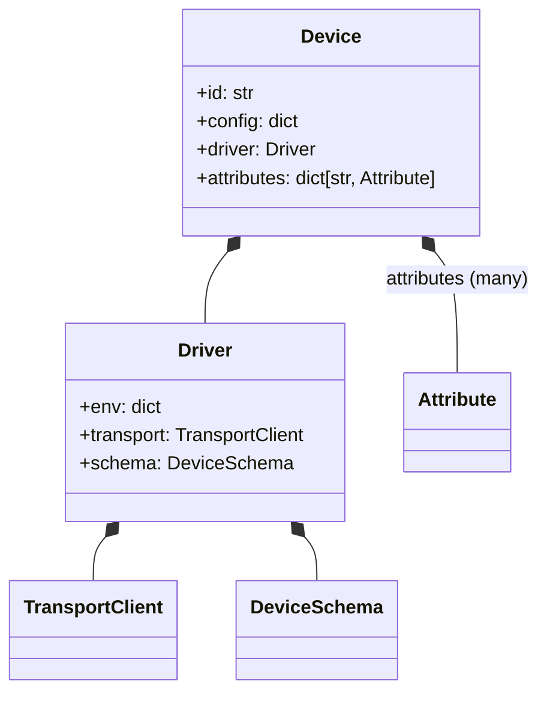

# GRIDONE (WiP 🏗️)

_Gridone_ is an open-source Building Management System (BMS) designed for extensibility and portability.

Gridone is built by [AGRID](https://a-grid.com/) and welcomes all contributors.

## Project structure



## Setup

### Installation

This project is managed with [uv](https://docs.astral.sh/uv/). Run

```sh
uv sync
```
To create a virtual environment and install project dependencies.

### Tooling

Gridone uses [astral.sh](https://astral.sh) python development tools:
- [ruff](https://docs.astral.sh/ruff/) for linting and formatting,
- [ty](https://docs.astral.sh/ty/) for type checking,

See astral's documentation for IDE integration.

Along with [pytest](https://docs.pytest.org/en/stable/) for tests.

```sh
uv run ruff check # linting
uv run ruff format # formatting
uv run ruff format --check # format check
uv run ty check # type check
uv run pytest # runs tests
```
