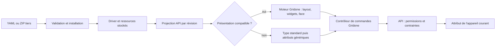

# ADR proposée — Présentations d’appareils définies par les drivers

- **Statut :** proposition ; É2–É5 implémentées et vérifiées localement, porte matérielle É6 en attente ; phase 0 close le 9 septembre 2026 — vocabulaire v1 gelé, voir [annexe B](driver-defined-device-ui-annex-b.md) (résultats des spikes, décisions de porte, budgets) et [annexe A](driver-defined-device-ui-annex-a.md) (inventaire firmware).
- **Date :** 9 septembre 2026.
- **Référence initiale du dépôt inspectée :** `1746ea76`, Gridone 0.226.0 ; implémentation locale jusqu’à `4e3bee60`, sans changement de version.
- **Périmètre :** contenu de la page de détail d’un appareil.
- **Décision recommandée :** document déclaratif versionné dans le driver, widgets et moteur graphique génériques dans Gridone, ressources locales distribuables en ZIP.
- **Livrable :** décision d’architecture, plan initial et suivi d’implémentation. Le [rapport de validation](driver-defined-device-ui-validation.md) consigne les commits, tests, mutations, mesures de rendu et limites des audits locaux. L’acceptation reste conditionnée aux preuves manquantes, dont les dix essais matériels de l’annexe A §6.

## 1. Exigences établies pendant l’entretien

| Sujet              | Exigence retenue                                                                                                                                                             |
| ------------------ | ---------------------------------------------------------------------------------------------------------------------------------------------------------------------------- |
| Compatibilité      | Un driver sans présentation conserve exactement le chemin de rendu standard actuel, puis les panneaux génériques.                                                            |
| Contrôle éditorial | Le driver dicte la composition du contenu : sections, disposition, contrôles, mesures et représentation graphique.                                                           |
| Fidélité           | La représentation du thermostat doit reproduire exactement ses proportions, glyphes, positions et couleurs. Une simple variante du cadran standard ne suffit pas.            |
| Interactivité      | La réplique commande réellement l’appareil.                                                                                                                                  |
| Envoi              | Les changements sont envoyés directement ; aucun bouton de validation générale ni lot de modifications à appliquer. Un court debounce peut regrouper les incréments répétés. |
| Simulation         | Aucun mode essai, émulateur de firmware ou prédiction des effets de réglages non appliqués.                                                                                  |
| Distribution       | YAML seul ou ZIP contenant le YAML et des ressources graphiques.                                                                                                             |
| Confiance          | Des tiers peuvent fournir des paquets installés sans revue préalable de l’équipe Gridone.                                                                                    |
| Incompatibilité UI | Si l’installation ne comprend pas la présentation, le driver reste utilisable avec un repli standard/générique et un diagnostic visible.                                     |
| Extensibilité      | Aucun branchement sur une marque, un modèle ou un identifiant de driver dans le code partagé.                                                                                |

Le besoin de présentation ne donne pas au driver une liberté d’exécution équivalente à celle du code de l’application. L’auteur choisit une composition et des interactions dans un vocabulaire documenté. Une interaction réellement nouvelle peut demander une capacité générique supplémentaire dans Gridone.

**Non-objectifs de la v1 :** personnalisation du menu global, des onglets de navigation, des cartes de liste ou des dashboards ; nouveaux rôles métier ; commandes vers d’autres appareils ; « appliquer aux autres chambres » ; opérations multi-attributs atomiques ; OTA et transfert de fichiers vers le matériel ; marketplace ; JavaScript tiers ; HTML libre ; CSS libre ; éditeur graphique complet.

L’installation hors Internet et une distribution sans reconstruction de Gridone sont des objectifs d’architecture proposés : les ressources du nouveau contrat sont locales au paquet. Il ne s’agit pas d’une promesse de migration immédiate de tous les anciens `image_src` externes.

## 2. État réel du dépôt et lecture critique des références

### Chaîne à la référence initiale

Cet état décrit le point de départ `1746ea76`. Les changements livrés sont recensés au §14 et dans le [rapport de validation](driver-defined-device-ui-validation.md).

1. `DriverSpec.from_yaml()` utilise `yaml.safe_load()` et Pydantic. Le DTO est converti en `Driver`, puis en `DriverRecord` pour les stockages mémoire/YAML ; PostgreSQL utilise une projection avec une liste explicite de champs JSONB.
2. Le driver déclare un `type` et des attributs. Le schéma standard thermostat impose notamment température, consigne, marche/arrêt et mode ; ventilation et bornes sont optionnelles.
3. `Device` expose le type, les attributs et `driver_id`, mais aucun document de présentation. Les types TypeScript viennent de l’OpenAPI, pas d’un modèle frontend indépendant.
4. `DeviceLiveControl` choisit `Supervision ?? Control` dans le registre des types, puis affiche `DeviceAttributePanes`. ThermostatSupervision compose le contrôle et le graphique 24 h.
5. Les cartes et dashboards utilisent aussi ce registre. Modifier globalement son comportement ferait déborder le périmètre demandé.
6. Les contrôles thermostat envoient déjà des commandes via `useDebouncedAttributeWrite`. `useDeviceDetails` réinitialise les valeurs locales quand l’objet device change : ce hook ne suffit pas pour coordonner deux représentations interactives et des mises à jour WebSocket concurrentes.
7. Le backend peut confirmer une écriture par rapprochement avec la valeur lue ou reçue. Il peut aussi accepter une valeur déjà présente dans le cache ; ce n’est pas une preuve universelle d’un nouvel acquittement matériel.
8. `value_options` existe déjà sur les attributs API et provient de la chaîne de codecs côté backend. Le frontend ne doit pas interpréter lui-même les codecs.
9. L’import UI actuel est un formulaire de texte YAML. Il n’y a pas de gestion de paquets UI ZIP. Le fichier nginx inspecté ne définit pas de CSP.

Sources de code :

- [DriverSpec et conversions](/Users/bastien/code/Agrid/gridone/packages/devices_manager/src/devices_manager/dto/driver_dto/driver_dto.py), [Driver](/Users/bastien/code/Agrid/gridone/packages/devices_manager/src/devices_manager/core/driver/driver.py), [stockage des drivers](/Users/bastien/code/Agrid/gridone/packages/devices_manager/src/devices_manager/storage/driver_record.py), [projection PostgreSQL](/Users/bastien/code/Agrid/gridone/packages/devices_manager/src/devices_manager/storage/postgres/driver_storage.py).
- [Device DTO](/Users/bastien/code/Agrid/gridone/packages/devices_manager/src/devices_manager/dto/device_dto.py), [schéma thermostat](/Users/bastien/code/Agrid/gridone/packages/devices_manager/src/devices_manager/core/standard_schemas/registry/thermostat.py), [génération SDK](/Users/bastien/code/Agrid/gridone/sdk/ts/package.json).
- [DeviceLiveControl](/Users/bastien/code/Agrid/gridone/apps/ui/src/pages/devices/device/DeviceLiveControl.tsx), [registre standard](/Users/bastien/code/Agrid/gridone/apps/ui/src/pages/devices/standard-devices/registry.ts), [DeviceAttributePanes](/Users/bastien/code/Agrid/gridone/apps/ui/src/pages/devices/device/DeviceAttributePanes.tsx).
- [écritures frontend](/Users/bastien/code/Agrid/gridone/apps/ui/src/hooks/useDebouncedAttributeWrite.ts), [état local actuel](/Users/bastien/code/Agrid/gridone/apps/ui/src/hooks/useDeviceDetails.ts), [confirmation backend](/Users/bastien/code/Agrid/gridone/packages/devices_manager/src/devices_manager/core/device/device.py), [commandes HTTP](/Users/bastien/code/Agrid/gridone/packages/api/src/api/routes/command_router.py), [WebSocket](/Users/bastien/code/Agrid/gridone/apps/ui/src/api/socket.ts).
- [import YAML](/Users/bastien/code/Agrid/gridone/apps/ui/src/pages/drivers/DriverForm.tsx), [permissions](/Users/bastien/code/Agrid/gridone/packages/api/src/api/permissions.py), [nginx](/Users/bastien/code/Agrid/gridone/docker/nginx.conf.template).

### Proposition Notion

La [proposition](https://app.notion.com/p/3d5e7a2bcfa381d2beb7e29a8188838a) et son [annexe](https://app.notion.com/p/3d5e7a2bcfa381e59a75db6b65e2dc6a) identifient correctement le besoin de métadonnées d’attributs, de résolution explicite et de repli. Plusieurs conclusions sont à corriger :

- Un dossier de composants Agrid et une entrée de registre concentrent le code spécifique, mais le conservent dans l’application. Ils ne satisfont pas l’objectif retenu de présenter un nouveau produit avec un paquet de données.
- Les mêmes props React ne constituent pas une frontière de sécurité. Un composant chargé dans la page peut accéder aux API du navigateur, indépendamment de ses props.
- L’affirmation selon laquelle le déclaratif ne permet pas un fond noir et des chiffres ambre est trop restrictive. Une surface graphique à coordonnées explicites, des ressources et des bindings peuvent exprimer ces choix. Le vrai sujet est l’étendue du vocabulaire et son coût d’authoring.
- Le passage ultérieur à une iframe isolée ne conserve pas nécessairement un contrat de composants React : il introduit un protocole de messages et un autre cycle de vie. Cette migration n’est pas gratuite.
- Le repli sur l’identifiant du driver évoqué dans l’annexe contredit la résolution explicitement déclarée et peut changer l’apparence d’un ancien driver. Il est exclu.
- Lire les mappings de codecs dans l’UI serait un couplage supplémentaire inutile : utiliser `value_options`, déjà présent.
- Le registre par marque ne détermine ni la licence du produit ni sa capacité commerciale à servir d’autres OEM. Ce sont des décisions distinctes.
- Les estimations « jours » et « semaines » ne sont pas suffisamment étayées par les besoins finalement retenus pour servir de planning.

Les décisions, deadlines et listes de tâches contenues dans Notion sont des éléments à examiner, pas des instructions adoptées automatiquement.

### Captures et prototype HTML

[current.png](/Users/bastien/Desktop/current.png) montre le comportement standard à préserver. [target.png](/Users/bastien/Desktop/target.png) et le [prototype HTML](/Users/bastien/Downloads/Direction-html/Direction.dc.html) apportent la référence graphique. Le HTML a été lu et exercé dans un navigateur : incrément, annulation et panneau Réglages.

Le prototype contient des variantes de profil, des verrous locaux, des paramètres d’affichage, des brouillons, un mode essai et une réussite simulée après 700 ms. **La validation générale, le mode essai et le faux acquittement sont explicitement exclus par les réponses de l’utilisateur.** Les interactions restantes doivent être reliées à des attributs réels avant d’être promises.

| Besoin                                             | Nature et propriétaire                                                                                        |
| -------------------------------------------------- | ------------------------------------------------------------------------------------------------------------- |
| Groupes, libellés, descriptions, unités, recherche | Métadonnées et composants génériques Gridone ; enrichissement facultatif du driver.                           |
| Sélecteur de ventilation ou de mode                | Contrôle d’énumération générique, options issues du contrat d’attribut.                                       |
| Réglage numérique borné                            | Contrôle générique ; contraintes de données séparées des préférences graphiques.                              |
| Envoi, pending, erreur, non-confirmation           | Infrastructure Gridone commune à toutes les représentations.                                                  |
| Mesures, occupation, fenêtre                       | Données d’appareil à présenter ; ni calcul de présence ni détection de fenêtre dans le moteur UI.             |
| Géométrie du boîtier, glyphes, couleurs de l’écran | Ressources et composition spécifiques au produit, dans le paquet driver.                                      |
| Verrou d’une touche physique                       | Attribut et binding explicite lorsque le firmware l’expose ; distinct des permissions de l’opérateur distant. |
| Onglets, personas, copie vers plusieurs chambres   | Hors périmètre de cette présentation v1.                                                                      |

Le [document de synoptiques existant](/Users/bastien/code/Agrid/gridone/docs/specs/synoptic-document.md) est encore une spécification. Il interdit volontairement coordonnées écran, styles et écritures : il ne convient pas tel quel à une réplique interactive exacte. Réutiliser des primitives éprouvées si elles deviennent communes, sans forcer les deux formats dans un moteur universel. Le registre de widgets dashboards fournit un précédent utile de validation Pydantic et de schémas exposés, sans autoriser un import entre ces services.

## 3. Critères et comparaison

Priorités : absence de code par marque ; fidélité exacte ; auteur tiers sans rebuild pour les capacités existantes ; contenu non exécutable ; compatibilité de contrôle ; ergonomie et accessibilité ; complexité raisonnable pour la première version.

| Architecture                                          | Points forts                                                                              | Limites et coût                                                                                                          | Conclusion                                    |
| ----------------------------------------------------- | ----------------------------------------------------------------------------------------- | ------------------------------------------------------------------------------------------------------------------------ | --------------------------------------------- |
| Provider React par produit, compilé dans Gridone      | Liberté graphique et comportementale ; outillage React existant                           | Couplage aux releases, revue de chaque produit, code spécifique dans le dépôt ; props et lint ne créent pas d’isolation  | Écarté pour l’objectif retenu                 |
| Schéma de formulaires déclaratif                      | Très bon pour groupes, champs, validation et options                                      | Ne décrit pas seul une face matérielle exacte                                                                            | Une capacité du moteur, pas toute la solution |
| Sélection d’un layout Gridone                         | Simple, robuste, peu de paramètres                                                        | Trop peu de liberté si le driver doit dicter toute la page ; multiplication possible des layouts « presque spécifiques » | Utile comme raccourci facultatif              |
| Widgets, slots et bindings                            | Contrats petits et testables ; réutilisation des interactions                             | Les slots fixes ne suffisent pas à toutes les géométries matérielles                                                     | Socle recommandé                              |
| Tokens ou CSS fourni par le driver                    | Tokens : couleurs et densité contrôlables. CSS : forte liberté de style                   | CSS seul ne lie pas les attributs aux commandes ; dépendance au DOM, sécurité, thème et accessibilité                    | Tokens typés limités ; CSS libre écarté       |
| Composition déclarative + widgets + surface graphique | Liberté de composition, exactitude via ressources, aucune logique par marque dans Gridone | Contrat à concevoir, validation et outillage nécessaires ; interactions limitées au vocabulaire supporté                 | Recommandé                                    |
| Plugin UI chargé à l’exécution                        | Extension comportementale sans rebuild                                                    | Code tiers, isolement, pont de commandes, distribution, mises à jour et compatibilité supplémentaires                    | Non justifié maintenant                       |

Des solutions telles que [JSON Forms](https://jsonforms.io/docs/uischema/) illustrent la séparation données/UI et les layouts déclaratifs. Leur adoption ne fournirait pas à elle seule la surface graphique requise ; aucun framework supplémentaire n’est prescrit avant le spike.

## 4. Décision : deux formes de composition, un seul contrat d’interaction

### Composition de page

Le document décrit un arbre borné de nœuds : pile, colonnes, section, groupe de contrôles, liste de mesures, liste d’attributs, historique simple et surface graphique. Les proportions et l’ordre sont déclarés. Gridone fournit les breakpoints, le reflow, les composants accessibles et les états d’erreur.

Il n’y a pas de profil `agrid_thermostat` dans un registre applicatif. Les identifiants enregistrés sont des capacités telles que `number-control`, `enum-control` et `device-face`. Le driver peut répéter ou recomposer ces éléments ; les données d’interaction communes ne sont pas dupliquées.

### Surface graphique exacte

Un `device-face` est une surface de référence avec largeur/hauteur fixes. Le document y place des images, valeurs, glyphes et zones d’interaction dans des rectangles. L’échelle conserve les proportions. Le reste de la page garde un layout fluide.

Le boîtier et les ornements peuvent être des images PNG/WebP ; les chiffres particuliers peuvent utiliser un atlas de glyphes déclaré. Les zones interactives sont des éléments sémantiques Gridone superposés, avec nom accessible et focus. Un atlas ne remplace jamais la valeur textuelle accessible.

Les variantes ON/OFF, les icônes dépendantes du mode et les verrous sont des sélections finies sur des valeurs d’attributs. Des conditions bornées `eq`, `in`, `all`, `any`, `not`, `is_known` suffisent au premier vocabulaire. Ni fonctions, ni expressions JavaScript, ni accès arbitraire à des chemins objet, ni appels réseau ne sont acceptés.

Les widgets offrent des interactions Gridone : définir une valeur, basculer un booléen, incrémenter/décrémenter, parcourir des options. Une interaction vise un contrôle déclaré, lié à **un attribut de l’appareil courant**. Aucun sélecteur de devices, endpoint, méthode HTTP ou script n’est fourni par le driver.

Une dépendance absente, une valeur inconnue ou des bornes incohérentes n’activent jamais silencieusement une commande. Le composant montre un état indisponible ou déclenche le repli décrit plus bas.

### État et commandes

Un contrôleur de page commun gère les intentions en cours par attribut. Le formulaire et la réplique lisent le même état et utilisent la même file de commandes ; leur démontage ou un repli visuel ne réinitialise pas une écriture déjà partie.

- Une action discrète part immédiatement. Les incréments rapides sont regroupés avec le délai Gridone existant de 600 ms comme point de départ.
- Il y a au plus une écriture en vol par attribut et par page. Une nouvelle intention remplace la suivante en attente, pas une commande déjà envoyée.
- Les contrôles peuvent afficher la valeur demandée pendant l’envoi, avec un état Gridone explicite. Les mesures restent les valeurs rapportées. Une intention n’est pas injectée comme télémétrie dans le cache global.
- Les mises à jour WebSocket ne doivent pas écraser une intention plus récente. Résolutions et erreurs sont associées à une séquence locale et, dès réception, au résultat de commande.
- Sur échec/non-confirmation, montrer la dernière valeur connue et le résultat réel ; ne pas prétendre avoir annulé l’action physique. Pas de retry automatique de commande.
- Sur changement d’appareil, annuler les timers non envoyés ; une commande déjà partie peut se terminer sans être attribuée au nouvel appareil.
- Aucun write au montage, au chargement d’asset, à un changement de télémétrie ou à l’évaluation d’une condition.

Le bouton « Valider » disparaît, **la validation des valeurs et l’autorisation serveur restent obligatoires**. Les contraintes d’écriture relèvent des attributs du driver et du service, pas d’un nœud UI. Un pas graphique ou une plage affichée peut restreindre une interaction, jamais élargir les valeurs autorisées. Les verrous matériels locaux ne deviennent pas implicitement des permissions distantes.

## 5. Frontières backend, API et frontend

| Couche          | Responsabilités                                                                                                                                   |
| --------------- | ------------------------------------------------------------------------------------------------------------------------------------------------- |
| YAML/paquet     | Métadonnées d’attribut, document UI, bindings locaux, ressources graphiques, version et capacités requises                                        |
| devices_manager | Import borné, validation de contrat et de références, conservation du document, diagnostics, résolution des métadonnées et contraintes d’écriture |
| storage/        | Persistance de documents et ressources, activation atomique des révisions, migrations, fichiers temporaires et nettoyage                          |
| API             | Upload HTTP, permissions, projection de présentation, diffusion authentifiée des ressources et schémas ; aucune règle produit                     |
| SDK             | Types issus d’OpenAPI et méthodes d’accès ; aucun codec ni renderer                                                                               |
| UI Gridone      | Résolution de compatibilité, widgets, moteur graphique, état de commande, accessibilité, thème et repli                                           |

Commencer dans `devices_manager/core/presentation/`, sans nouveau service autonome. Les classes de stockage ne sortent pas de `storage/`. Le service possède déjà trois backends : un port de ressources a donc plusieurs implémentations justifiées. Ne pas importer le service `assets` : il décrit les actifs du bâtiment, pas une bibliothèque partagée de médias de drivers.

**Projection implémentée :**

- `Device` expose une référence facultative `presentation_ref` contenant une révision opaque. Elle est dérivée du driver et n’est pas recopiée dans chaque device stocké.
- `GET /devices/{device_id}/presentation?revision=...` retourne une union discriminée par `status` : `available` avec `revision`, `document` et `assets`, ou `unavailable` avec `revision` et `diagnostics`. Les champs optionnels absents sont omis du JSON ; les valeurs par défaut Python `None` ne sont pas exposées comme des `null` au renderer. Permission `DEVICES_READ` ; aucune exposition supplémentaire de `env`, adresses de transport ou configuration secrète.
- Une révision différente de celle demandée provoque une réponse de conflit contrôlée et un refetch du device ; aucune composition avec un ancien contrat d’attributs.
- Les ressources sont servies sous une route de l’appareil et de la révision. L’UI les récupère via le client authentifié, puis utilise des URL Blob révoquées au démontage. Jamais de token dans une URL.
- Le document est chargé une fois par appareil/révision et non à chaque valeur reçue. Une mise à jour de présentation publie la nouvelle référence via les mises à jour complètes de devices existantes.
- `GET /presentations/schema` annonce le schéma, les versions/capacités supportées et les budgets pour les outils d’auteur. Les diagnostics sont des codes Gridone et chemins de champs, pas les messages bruts d’exceptions.

La révision prend en compte le document, les contrats d’attributs liés, les digests de ressources et la version du normaliseur. Deux transports peuvent utiliser la même composition sans nécessiter une clé de provider commune.



## 6. Résolution et repli

Ordre strict, **uniquement dans le contenu de page** :

1. Présentation déclarée, sûre, compatible et utilisable.
2. Entrée standard du `device.type` : `Supervision`, puis `Control`.
3. Panneaux génériques d’attributs.

Le chemin standard conserve ses panneaux d’attributs actuels. Sur une page personnalisée, Gridone garde un accès stable « Tous les attributs » et les diagnostics hors du document personnalisable ; le driver peut aussi insérer une liste d’attributs dans son contenu. Les défauts actifs et l’état de connexion du cadre restent accessibles.

| Situation                                                    | Résultat                                                                        |
| ------------------------------------------------------------ | ------------------------------------------------------------------------------- |
| Aucun document UI                                            | Chemin historique, sans avertissement                                           |
| Version ou capacité inconnue côté serveur ou navigateur      | Driver actif, présentation ignorée, repli avec diagnostic                       |
| Document v1 incorrect lors d’un nouvel import                | Import refusé avec erreurs de champs ; ancienne révision inchangée              |
| Archive dangereuse, fichier interdit ou limites dépassées    | Paquet refusé, quelle que soit la version UI                                    |
| Document devenu invalide après une modification de driver    | Repli visible ; jamais d’interruption du transport due à la présentation        |
| Ressource indispensable absente/corrompue ou erreur de rendu | Repli de la présentation entière, contrôleur de commandes conservé              |
| Valeur temporairement inconnue                               | Widget indisponible ; pas de repli systématique pour un simple null             |
| Erreur d’écriture / permission insuffisante                  | Erreur ou contrôle désactivé ; aucun repli qui tenterait de contourner le refus |

Ne pas rendre un sous-ensemble arbitraire d’une réplique dont une capacité requise manque : supprimer une condition ou une zone peut en changer le sens. Une erreur frontend est contenue par une boundary dédiée ; elle n’emporte pas les onglets et le cadre de l’appareil.

## 7. Distribution et authoring

Un paquet contient exactement un manifeste `driver.yaml` à la racine et les fichiers qu’il référence :

```text
thermostat.zip
├── driver.yaml
└── assets/
    ├── case.png
    ├── digits.png
    ├── power.png
    └── modes.png
```

Le manifeste reste un driver existant enrichi d’un champ optionnel `presentation`. Le YAML seul peut utiliser les widgets natifs sans ressource externe ; un chemin vers une ressource absente du paquet est une erreur, pas une demande de lecture sur le disque du serveur. Aucun téléchargement automatique d’une URL déclarée par le driver.

Workflow livré : éditer YAML et ressources, lancer `gridone drivers validate <fichier-ou-zip>`, consulter les erreurs localisées, assembler avec `gridone drivers pack`, puis importer le YAML ou ZIP dans l’UI ou via `PUT /drivers/{id}/package`. Le remplacement sur `/drivers/:id/edit` transmet `expected_revision` ; un conflit 409 exige une recharge explicite avant nouvel envoi. L’export retourne un ZIP complet. Le même validateur sert à la CLI et au serveur ; la [référence publique](../src/reference/device-presentations.md#packaging-and-import) donne les commandes et limites. Un banc de développement affiche des fixtures de télémétrie et teste les commandes avec des adaptateurs de test ; il n’ajoute pas un mode essai au produit.

Les ressources et compositions sont livrables indépendamment de Gridone tant qu’elles utilisent des capacités déjà supportées. Une capacité absente passe par une contribution générique avec schéma, renderer, tests et documentation. Le premier auteur peut être Agrid ; le mécanisme ne lui donne aucun privilège supplémentaire.

Les ressources originales restent avec le driver. Pour les variantes MQTT et Modbus, dupliquer un fragment à la compilation du paquet ou utiliser un outil d’authoring commun est acceptable. Éviter en v1 les imports YAML distants, héritages ou dépendances entre paquets à résoudre à l’exécution.

## 8. Exemple YAML

**Extrait proposé à ajouter à un driver existant.** Les attributs cités doivent exister ; les chemins, l’atlas et coordonnées sont illustratifs, pas un driver Agrid prêt à installer. Les contraintes numériques effectives viennent du contrat d’attribut. L’exemple réduit la réplique à la consigne et à deux touches pour garder le contrat lisible.

```yaml
presentation:
  schema_version: 1
  requires: [layout/1, controls/1, device-face/1, glyph-number/1]
  assets:
    case: { path: assets/case.png }
    digits: { path: assets/digits.png }
  glyph_sets:
    lcd:
      asset: digits
      characters: "0123456789.-"
      cell: { width: 64, height: 96 }
  bindings:
    measured: { attribute: temperature }
    target: { attribute: temperature_setpoint }
    power: { attribute: onoff_state }
    mode: { attribute: mode }
    fan: { attribute: fan_speed }
    humidity: { attribute: humidity }
  controls:
    power:
      kind: toggle
      binding: power
      label: { default: Power, translations: { fr: Marche / arrêt } }
    target:
      kind: number
      binding: target
      label: { default: Setpoint, translations: { fr: Température demandée } }
    mode:
      kind: select
      binding: mode
      label: { default: Mode }
    fan:
      kind: select
      binding: fan
      label: { default: Fan speed, translations: { fr: Ventilation } }
  page:
    kind: columns
    items:
      - weight: 3
        content:
          kind: stack
          children:
            - kind: control-panel
              controls: [power, target, fan, mode]
            - kind: measurements
              bindings: [measured, humidity]
      - weight: 2
        content:
          kind: device-face
          label: { default: Thermostat }
          view_box: { width: 560, height: 400 }
          layers:
            - kind: image
              asset: case
              box: { x: 0, y: 0, width: 560, height: 400 }
            - kind: glyph-number
              binding: target
              glyph_set: lcd
              decimals: 1
              box: { x: 180, y: 115, width: 200, height: 100 }
              visible_when: { op: eq, binding: power, value: true }
            - kind: button
              box: { x: 65, y: 135, width: 120, height: 100 }
              label:
                {
                  default: Decrease setpoint,
                  translations: { fr: Diminuer la consigne },
                }
              action: { control: target, op: decrement }
              visible_when: { op: eq, binding: power, value: true }
            - kind: button
              box: { x: 375, y: 135, width: 120, height: 100 }
              label:
                {
                  default: Increase setpoint,
                  translations: { fr: Augmenter la consigne },
                }
              action: { control: target, op: increment }
              visible_when: { op: eq, binding: power, value: true }
```

Les touches superposées n’imposent pas un dessin de bouton standard : les signes peuvent être portés par une couche graphique, tandis que Gridone gère cible tactile, sémantique, focus et activation. Les atlas définitifs doivent permettre les tailles distinctes des chiffres entiers/décimaux et les symboles d’unité de la référence ; ce point appartient au spike de fidélité avant gel du schéma.

Pour la consigne de cet exemple, l’attribut doit aussi déclarer les contraintes de données proposées ci-dessous, indépendamment de sa présentation et de ses adresses de transport :

```yaml
write_constraints:
  step: 0.5
  minimum: { attribute: temperature_setpoint_min }
  maximum: { attribute: temperature_setpoint_max }
```

Ce champ est une extension à implémenter, pas une capacité déjà disponible. Les bornes peuvent aussi être des constantes numériques. Les mêmes règles sont consultées par le renderer et appliquées par le service à chaque écriture, y compris depuis le CLI ou l’API. Si le pas est inconnu, un contrôle numérique ne propose pas d’incrément arbitraire ; si une borne déclarée est inconnue, il reste indisponible. Une présentation ne peut pas réécrire les contraintes du driver.

Les textes suivent la résolution locale exacte → langue de base → `default` → libellé d’attribut connu. Le driver peut présenter des libellés et pictogrammes de valeurs, mais conserve les valeurs canoniques des attributs. Une option non reconnue reçoit un rendu textuel sûr ; elle n’est pas supprimée parce que Gridone ne possède pas son icône.

## 9. Contrats TypeScript illustratifs

Ces types décrivent le vocabulaire initial, pas un second schéma à maintenir à la main. L’implémentation les générera depuis les modèles Pydantic/OpenAPI. Les longueurs, valeurs finies, plages et compatibilités entre références sont vérifiées par le schéma et le validateur sémantique.

```typescript
type Scalar = string | number | boolean;
type BindingId = string;
type ControlId = string;
type AssetId = string;
type LocalizedText = {
  default: string;
  translations?: Record<string, string>;
};
type Box = { x: number; y: number; width: number; height: number };
type Size = { width: number; height: number };

type Condition =
  | { op: "eq"; binding: BindingId; value: Scalar }
  | { op: "in"; binding: BindingId; values: Scalar[] }
  | { op: "is_known"; binding: BindingId }
  | { op: "not"; condition: Condition }
  | { op: "all" | "any"; conditions: Condition[] };

type Control = {
  kind: "toggle" | "number" | "select";
  binding: BindingId;
  label: LocalizedText;
};

// L'opération est vérifiée contre le kind du contrôle référencé.
type FaceAction = {
  control: ControlId;
  op: "toggle" | "increment" | "decrement" | "cycle";
};

type Layer = {
  box: Box;
  visible_when?: Condition;
} & (
  | { kind: "image"; asset: AssetId }
  | {
      kind: "glyph-number";
      binding: BindingId;
      glyph_set: string;
      decimals: number;
    }
  | {
      kind: "button";
      label: LocalizedText;
      action: FaceAction;
      blocked_when?: Condition;
    }
);

type PageNode =
  | { kind: "stack"; children: PageNode[] }
  | {
      kind: "columns";
      items: { weight: number; content: PageNode }[];
    }
  | { kind: "control-panel"; controls: ControlId[] }
  | { kind: "measurements"; bindings: BindingId[] }
  | { kind: "attributes" }
  | {
      kind: "device-face";
      label: LocalizedText;
      view_box: Size;
      layers: Layer[];
    };

type PresentationV1 = {
  schema_version: 1;
  requires: string[];
  assets: Record<AssetId, { path: string }>;
  glyph_sets?: Record<
    string,
    { asset: AssetId; characters: string; cell: Size }
  >;
  bindings: Record<BindingId, { attribute: string }>;
  controls: Record<ControlId, Control>;
  page: PageNode;
};

type PresentationDiagnostic = {
  code:
    | "unsupported_version"
    | "unsupported_capability"
    | "invalid_document"
    | "missing_binding"
    | "asset_unavailable";
  path?: string;
};

type PresentationResponse =
  | {
      status: "available";
      revision: string;
      document: PresentationV1;
      assets: Record<AssetId, { sha256: string; media_type: string }>;
    }
  | {
      status: "unavailable";
      revision: string;
      diagnostics: PresentationDiagnostic[];
    };

// Contrat interne du moteur. Aucun objet de ce type ne vient du ZIP.
type WriteState =
  | { kind: "idle" }
  | { kind: "sending"; requested: Scalar }
  | { kind: "confirmed"; requested: Scalar }
  | { kind: "error" | "unconfirmed"; requested: Scalar; message: string };

type BoundControlState = {
  reported: Scalar | null;
  displayed: Scalar | null;
  writable: boolean;
  write: WriteState;
};

type DeviceUiRuntime = {
  readControl(id: ControlId): BoundControlState;
  setValue(id: ControlId, value: Scalar): void;
  activate(action: FaceAction): void;
};
```

Les composants de formulaire, mesures et réplique utilisent le runtime Gridone. Ce contrat n’est pas un bac à sable pour composants tiers : aucun composant tiers n’est chargé.

## 10. Validation et versionnement

### Séparer conservation et exécution

La racine driver accepte une présentation JSON-compatible optionnelle. À cette frontière de compatibilité, un type récursif `JsonValue` borné est justifié : un vieux serveur doit pouvoir conserver une version future sans comprendre tous ses nœuds. Le code normal utilise ensuite un `PresentationV1` validé, jamais un `dict[str, Any]` parcouru opportunément.

Trois étapes :

1. Validation du driver de transport et de l’enveloppe de paquet : YAML sûr, objets JSON compatibles, budgets, noms et ressources autorisés. Les métadonnées UI ne permettent pas de contourner une incompatibilité du transport lui-même.
2. Lecture de `schema_version` et `requires`. Version/capacité non supportée : conserver les données inertes, enregistrer le diagnostic, continuer avec le driver.
3. Version connue : Pydantic avec champs supplémentaires interdits, unions discriminées, puis validation sémantique des bindings, types, droits d’écriture du driver, ressources et opérations.

Au démarrage, une présentation incompatible ou corrompue ne doit pas faire échouer la reconstruction du `Driver` et faire disparaître ses devices. Le document conservé et son état de validation doivent être séparés du chargement opérationnel.

### Règles sémantiques

- Identifiants locaux uniques et bornés ; références existantes ; aucune référence à une autre instance ou à des secrets.
- Types : toggle → booléen, nombre → numérique, select → options typées. Les opérations sont compatibles avec le contrôle.
- Les ressources référencées existent, leurs dimensions et atlas sont cohérents ; les zones interactives restent dans la surface. Recouvrements d’ornements possibles ; recouvrements ambigus de cibles refusés.
- Conditions : comparaisons typées, profondeur et nombre d’opérations bornés ; état inconnu propagé. Une condition de visibilité inconnue ne rend pas un contrôle actif, et une condition de blocage inconnue le désactive.
- Les contraintes numériques et options métier sont validées côté service au moment de l’écriture, avec les valeurs actuelles des attributs qui portent des bornes. Ajouter ce contrat de données explicitement ; ne pas confondre la vérification de type existante avec une validation complète de plage.
- Une modification/renommage/suppression d’attribut revalide les présentations concernées. Un renommage met à jour les références structurées d’une version connue, sans remplacer des chaînes dans les labels. Une version opaque non comprise devient indisponible si son contrat d’attributs change.
- Toute mise à jour est préparée sur une copie candidate et activée après persistance réussie ; aucune mutation en mémoire partielle si l’écriture de stockage échoue.

### Versions

`schema_version` est la version majeure du dialecte, distincte du `version` matériel/driver existant et de la révision de contenu. `requires` nomme les capacités sémantiques nécessaires. Une extension qu’un vieux lecteur ne peut ignorer annonce une nouvelle capacité ; une rupture de sens augmente la version majeure.

Pas de renommage silencieux de widget ni de changement de signification d’une ancienne action. Les fixtures de v1 restent lisibles pendant toute la durée de support de v1. La durée calendaire de support reste une politique produit à définir ; l’ADR ne promet pas un nombre d’années sans engagement.

Backend et frontend vérifient chacun leur compatibilité. Le frontend ne rend jamais un document parce que seul le backend l’a accepté. Des fixtures communes contrôlent la parité Pydantic/JSON Schema/TypeScript et la détection des capacités requises.

**Limite explicite :** un serveur antérieur à cette fonctionnalité ne sait pas importer un ZIP ni préserver automatiquement les champs qu’il ignore. La garantie de repli commence avec la première version qui implémente l’enveloppe ; elle ne peut être ajoutée rétroactivement aux anciens binaires.

## 11. Sécurité et isolation

### Paquets et ressources

Le modèle de menace inclut un auteur malveillant, une archive corrompue et une ressource coûteuse à décoder. L’autorisation d’installer un driver ne doit pas autoriser l’exécution de son contenu dans la session de tous les opérateurs.

Le chargement YAML sûr existant ne suffit pas à ce modèle de menace : limiter aussi profondeur et volume, refuser les clés dupliquées et les tags personnalisés, et refuser ou borner strictement les alias. Seuls des objets à clés chaîne et des scalaires JSON finis sont conservés dans l’enveloppe UI.

Mesures d’import : contrôler les tailles effectivement décompressées, le nombre de fichiers et les dimensions décodées ; refuser chemins absolus, traversées, séparateurs ambigus, doublons après normalisation, liens symboliques, archives imbriquées et entrées chiffrées. Lire les entrées avec une limite, sans extraction générale dans un répertoire servi. Vérifier type réel et décodage des images, puis réencoder les ressources admises. Le stockage utilise des identifiants générés et un mapping, jamais le chemin utilisateur directement. Ces défenses suivent les risques documentés par [OWASP sur les uploads](https://cheatsheetseries.owasp.org/cheatsheets/File_Upload_Cheat_Sheet.html).

La v1 accepte PNG et WebP statiques. Elle refuse HTML, JavaScript, CSS, fontes embarquées et SVG libre. Le choix d’un atlas graphique permet d’exprimer les glyphes exacts sans charger une police tierce. Un éventuel support SVG nécessite une décision dédiée : son comportement dépend du contexte d’intégration, et une image SVG n’a pas les mêmes permissions qu’un document SVG chargé directement. Voir [SVG comme image](https://developer.mozilla.org/en-US/docs/Web/SVG/Guides/SVG_as_an_image).

Budgets initiaux proposés, à confirmer avec les ressources réelles : YAML 1 Mio ; ZIP 20 Mio compressés, 50 Mio décompressés ; 128 fichiers ; 16 mégapixels par image et 64 au total ; 300 bindings, 300 contrôles, 600 nœuds/couches ; profondeur de layout 8, conditions 8 et 1 000 opérations maximum par évaluation. Les valeurs sont définies une fois dans le service, exposées aux outils, et ne sont pas des limites matérielles de l’appareil.

Les entités stockées utilisent `models.ids.gen_id()`. Les noms de bindings sont des clés locales d’auteur ; SHA-256 sert d’empreinte de contenu et non d’identifiant d’entité. Une empreinte vérifie l’intégrité, pas l’identité ou la bonne foi de l’auteur.

Les ressources sont récupérées avec une permission vérifiée à chaque requête, servies avec type exact et `X-Content-Type-Options: nosniff`. Pas de répertoire public contenant les ZIP ou le YAML complet. Nettoyer les URL Blob côté navigateur et limiter leur rétention en mémoire.

### Ce que CSS peut et ne peut pas résoudre

CSS peut définir couleurs, positions, typographie et certains états visuels déjà exposés dans le DOM. Il ne définit pas de manière robuste le binding d’un attribut, la création d’une commande, son autorisation, sa confirmation ou la gestion des erreurs. Une solution « CSS seulement » nécessiterait déjà un DOM et des comportements extensibles fournis par Gridone.

| Mécanisme                                         | Isolation obtenue                                | Limites                                                                                  |
| ------------------------------------------------- | ------------------------------------------------ | ---------------------------------------------------------------------------------------- |
| Préfixer les sélecteurs / CSS Modules / scope CSS | Réduit les collisions de noms                    | Ne valide pas les effets des propriétés, les ressources chargées ou les interactions     |
| Shadow DOM                                        | Encapsulation du style                           | N’isole pas le code de la session ; héritage, thème, focus et ressources restent à gérer |
| Iframe sandboxée                                  | Frontière de document/origine possible           | Nécessite protocole de données/commandes, dimensionnement et gestion du focus            |
| Tokens et propriétés typées                       | Surface limitée aux choix prévus par le renderer | Nécessite un vocabulaire de composition pour la fidélité demandée                        |

Un style non maîtrisé peut masquer des retours, déplacer des cibles ou superposer une interface trompeuse. Les possibilités de chargement de ressources ajoutent un canal réseau. Le simple préfixage des sélecteurs ne suffit donc pas ; [OWASP décrit notamment le détournement visuel par CSS](https://cheatsheetseries.owasp.org/cheatsheets/Securing_Cascading_Style_Sheets_Cheat_Sheet.html).

Recommandation : tokens sémantiques pour la page ; couleurs typées et géométrie finie à l’intérieur de la face ; ressources locales pour l’apparence précise. Aucun sélecteur, classe Tailwind arbitraire, propriété CSS libre, URL CSS ou `!important` fourni par le driver. Le DOM interne reste modifiable sans migrer les drivers.

### CSP

Ajouter une CSP adaptée à la distribution réelle, d’abord observée sur le build de production. Objectifs : scripts Gridone uniquement, absence d’eval ajouté par cette fonctionnalité, `object-src 'none'`, connexions limitées aux API configurées, images locales et Blob autorisées pour cette présentation.

Ne pas appliquer aveuglément `connect-src 'self'` si le déploiement utilise une API séparée ; inventorier aussi polices et anciens `image_src`. Tester la politique sur le produit existant avant activation obligatoire.

Pour la géométrie dynamique, affecter des propriétés de style autorisées depuis des valeurs numériques validées ; aucun assemblage de `cssText` ou de chaîne `style` issue du driver. La CSP distingue ces mécanismes, comme le précise [MDN pour style-src](https://developer.mozilla.org/en-US/docs/Web/HTTP/Reference/Headers/Content-Security-Policy/style-src). Vérifier le résultat avec React, les composants Radix et les navigateurs ciblés ; ne pas ajouter `unsafe-inline` pour contourner un problème non étudié.

### Permissions, vérité des données et plugins futurs

L’API reste autoritaire sur l’identité, le droit d’écriture et les contraintes métier. Les conditions UI ne sont jamais un contrôle d’accès. L’installation de paquets réutilise les permissions de drivers : le dépôt autorise actuellement les **operators**, et pas seulement les admins, à écrire des drivers. Toute restriction supplémentaire serait une décision produit séparée.

Du déclaratif peut encore mentir : une image ou un label peut désigner une commande différente du binding réel. Le contenu reste visuellement circonscrit, les actions sont auditables et l’inspecteur Gridone permet de voir les attributs réels. Cela ne prouve pas la correction d’un driver de transport mal conçu ; l’absence de code navigateur ne supprime pas le besoin de valider les drivers sur du matériel.

Des plugins exécutables ne seraient à réexaminer que si plusieurs intégrateurs ont besoin d’interactions impossibles à exprimer raisonnablement avec les capacités Gridone et doivent les livrer indépendamment. Un tel système exigerait un ADR distinct, avec iframe sur origine distincte ou origine opaque, sandbox minimale, protocole de messages validé, contrôle de la fenêtre source et capacités de commande filtrées par l’hôte. Une signature n’est pas une sandbox. Ne pas associer naïvement scripts et same-origin pour une iframe de la même origine ; voir [les restrictions iframe](https://developer.mozilla.org/en-US/docs/Web/HTML/Reference/Elements/iframe).

Le partage du thème par messages est possible ; il coûte du travail, mais n’est pas intrinsèquement impossible. Un contrat React interne ne devient pas automatiquement ce protocole.

## 12. Accessibilité, responsive et thème

**Fidélité de la face et accessibilité sont vérifiées séparément.** La vue normale reproduit les ressources et proportions approuvées. Focus, nom accessible, indication d’envoi et contrôles alternatifs restent fournis par Gridone.

- Les zones de commande sont des boutons/contrôles natifs avec activation clavier, état désactivé et ordre de focus explicite et stable. L’ordre des couches graphiques ne définit pas implicitement l’ordre de tabulation.
- Les chiffres graphiques ont une représentation textuelle accessible. Les erreurs et résultats sont annoncés sans lire continuellement chaque mesure.
- Une permission manquante, une valeur absente ou un état de connexion inconnu ne sont jamais communiqués uniquement par une couleur.
- Les cibles satisfont au minimum 24 × 24 pixels CSS ou aux exceptions d’espacement applicables ; viser 44 × 44 pour le tactile. Leur taille peut dépasser le dessin de l’icône sans modifier son apparence. Référence : [WCAG 2.2, taille minimale des cibles](https://www.w3.org/WAI/WCAG22/Understanding/target-size-minimum.html).
- Les colonnes se replient en pile. La face conserve son ratio ; elle ne doit pas imposer un défilement horizontal à toute la page. Vérifier à 320 pixels CSS et au zoom 400 %, conformément à l’objectif de [reflow](https://www.w3.org/WAI/WCAG22/Understanding/reflow.html).
- Si l’échelle rend les cibles insuffisantes, fournir les mêmes commandes dans une présentation textuelle accessible générée par Gridone à partir des contrôles déclarés. Ne pas compter sur une exception WCAG pour toute la page sous prétexte qu’elle contient un dessin.
- L’interface générale suit le thème de Gridone. La palette de la face reste celle du matériel, y compris en thème sombre ; les messages, bordures de focus et éléments autour restent thémables. Aucun token du driver ne s’applique à la navigation.
- Les atlas d’origine peuvent avoir un contraste insuffisant. Le spike doit mesurer ce point ; une alternative accessible et, si nécessaire, un rendu contrasté sont nécessaires avant une revendication de conformité. Ne pas affirmer que fidélité exacte implique automatiquement accessibilité.

Les labels de l’application sont localisés ; les nombres suivent le contrat d’unité et de précision. Une unité ou une langue réglée sur le matériel ne se déduit pas de celle du navigateur. Les codecs normalisent les données ; le renderer ne refait pas une conversion protocolaire.

## 13. Stockage, migration et retour arrière

1. Ajouter les métadonnées de présentation comme champs optionnels. Les anciens drivers et devices se chargent sans migration de contenu ni opt-in implicite.
2. Stocker la présentation dans le JSONB existant des drivers en complétant sa liste explicite de champs ; ajouter une table de ressources du même service. Mémoire : dictionnaire de blobs ; YAML : ressources à côté du stockage de drivers ; PostgreSQL : blobs bornés et métadonnées dans des tables `dm_*`.
3. Préparer un paquet complet, valider puis publier ses ressources immuables avant le compare-and-swap du driver durable. En PostgreSQL, la publication des ressources est transactionnelle puis le CAS est durable avant publication au registre ; la connexion déjà verrouillée est réutilisée. En YAML, synchroniser fichiers et répertoires puis remplacer atomiquement le pointeur actif ; en mémoire, remplacer le snapshot en une étape. Quatre crashs réels de processus couvrent les frontières de publication YAML ; ils ne constituent pas un essai de coupure électrique. Le verrou d’installation couvre aussi le transfert de synchronisation et les événements complets des devices.
4. Conserver temporairement la révision précédente pour retour arrière et les ressources référencées par des pages déjà ouvertes. Le stockage gère le nettoyage des ressources orphelines ; le service ne parcourt pas les fichiers.
5. Les PATCH de champs sans rapport préservent présentation et ressources. Une suppression explicite de présentation revient au rendu standard. Une installation modifiant uniquement la présentation ou ses ressources conserve les mêmes instances de devices, attributs, télémétrie, tâches de synchronisation et attentes de commande. La comparaison porte sur tous les autres champs du driver, en ignorant seulement les timestamps serveur ; le pointeur du driver est changé après CAS et une mise à jour complète est émise. Tout changement du contrat restant conserve la reconstruction et le transfert de synchronisation sous verrou.
6. Les sauvegardes et exports incluent les ressources. Restaurer uniquement le YAML d’un paquet avec images ne doit pas être présenté comme une restauration complète.
7. Livrer le backend et le SDK avant l’activation frontend. Le frontend se replie sur une ancienne API ; prévoir le comportement de cache après rollback.
8. Activer d’abord la présentation dans les seuls drivers pilotes. Aucun changement du type `thermostat` et aucune clé UI ajoutée automatiquement aux autres drivers.

Le retour arrière vers un binaire antérieur au support de paquets peut perdre les nouveaux champs lors d’une écriture : conserver une sauvegarde/export et documenter cette limite. Un backend conscient de l’enveloppe conserve les versions UI opaques.

## 14. Plan d’implémentation par phases et fichiers

Les tableaux de phases ci-dessous conservent le plan initial ; leurs chemins proposés ne sont pas un inventaire des fichiers livrés. L’état effectif au 9 septembre 2026 est le suivant :

| Étape     | État et preuve                                                                                                                                              |
| --------- | ----------------------------------------------------------------------------------------------------------------------------------------------------------- |
| É2-A      | Lecteur YAML/ZIP borné et normalisation, `d6d79846`.                                                                                                        |
| É2-B / É3 | Stockage et activation mémoire/YAML/PostgreSQL, projection et API, `ed083308` ; SDK et CLI, `6d93d6b0`.                                                     |
| É4        | Résolution et contrôles de la page device, `c5616827` ; permissions, contraste et débordement mobile corrigés dans `b4012e3c`.                              |
| É5        | Authoring YAML/ZIP et remplacement conditionnel, `42c0fa24` ; paquet pilote et collecteur dans `gridone-setup`, `0fe40451725d3face899f93bc4ab2eeb2e2d3947`. |
| É6        | Protocole préparé ; **aucun des dix essais matériels réalisé**.                                                                                             |
| É7        | Documentation et validation locale consignées ; ADR toujours proposée.                                                                                      |

Les correctifs finaux sont `9a7a4bab` (omission des champs optionnels nulls à la sérialisation HTTP), `cdf00d22` (conservation de la synchronisation visuelle) et `4e3bee60` (accessibilité des radios/tableaux).

Le [rapport de validation](driver-defined-device-ui-validation.md) donne les gates, la couverture, les mutations et les limites : 3 453 tests backend, 48 tests PostgreSQL réels, 200 tests SDK, 505 tests UI ciblés ; p95 de rendu après réception WebSocket synthétique local à 17,7 ms. Cette mesure ne représente pas un aller-retour broker ou matériel. L’audit d’accessibilité manuel et axe-core 4.13.0 reste ciblé : aucune violation détectée en clair/sombre sur desktop/mobile, avec un résultat de contraste incomplet sur six cellules mobiles masquées. La CSP demeure Report-Only.

Les chemins ci-dessous sont relatifs à la racine du dépôt. Les phases suivent les dépendances du plan initial.

### Phase 0 — Prouver le contrat avant de le figer

| Travail                                                                                                                                  | Fichiers / sortie                                                                                                    |
| ---------------------------------------------------------------------------------------------------------------------------------------- | -------------------------------------------------------------------------------------------------------------------- |
| Inventaire vérifié des bindings, types, unités, options, bornes, verrous et états exposés par les drivers réels                          | Ajouter une matrice à cette ADR ; consulter le dépôt de drivers et la documentation firmware, non inspectés ici      |
| Réplique fidèle sans code par produit dans le renderer : ON/OFF, modes, ventilation, consigne, mesures et verrou local réellement exposé | **Nouveau** banc `apps/ui/src/pages/sandbox/DevicePresentationSandbox.tsx` et fixtures déclaratives de développement |
| Deuxième cas structurellement différent, par exemple une pompe ou un contrôleur multicanal avec attributs renommés                       | Deuxième fixture utilisant exactement les mêmes primitives et mécanismes d’écriture                                  |
| Essai images/atlas, DPR 1 et 2, mobiles, clavier, contraste et CSP                                                                       | Captures de référence et rapport des écarts ; capacité glyphes stabilisée seulement après ce test                    |
| Import hostile et activation de révision après crash                                                                                     | Spike de parser/stockage avec limites mémoire mesurées                                                               |

**Sortie attendue :** aucun branchement vendor, tous les pixels variables et actions expliqués par des données, liste fermée des capacités initiales, et écarts de firmware explicités. Si la fidélité échoue, faire évoluer la primitive générique ou revoir le contrat avant de promettre la fonctionnalité.

### Phase 1 — Métadonnées et contrat de données

| Fichier                                                                                                                     | Modification                                                                                                                    |
| --------------------------------------------------------------------------------------------------------------------------- | ------------------------------------------------------------------------------------------------------------------------------- |
| **Nouveaux** `packages/devices_manager/src/devices_manager/core/presentation/models.py`, `validation.py`, `capabilities.py` | Modèles du dialecte, enveloppe opaque, diagnostics et vérification des références                                               |
| `core/driver/driver.py` ; `dto/driver_dto/driver_dto.py`                                                                    | Champ facultatif et conversions ; distinguer absence, suppression explicite et version inconnue                                 |
| `core/driver/attribute_driver.py` ; `core/device/attribute.py` ; `core/device/device.py`                                    | Métadonnées facultatives de libellé/groupe/unité ; contrat de contraintes d’écriture et projection, contrôle au moment du write |
| `core/driver_registry.py`                                                                                                   | Validation candidate avant mutation ; propagation structurée des renommages et invalidations                                    |
| `storage/driver_record.py` ; `storage/postgres/driver_storage.py`                                                           | Round-trip sans perte et ajout à la projection JSONB                                                                            |

Coordonner les unités avec l’ADR 0003 citée dans Notion mais absente de cette branche. Ne pas recréer une deuxième nomenclature. Réutiliser `value_options` ; les sentinelles invalides se corrigent dans une chaîne de codecs génériques, pas dans le renderer.

### Phase 2 — Installation et conservation de paquets

| Fichier                                                                                              | Modification                                                                                                                          |
| ---------------------------------------------------------------------------------------------------- | ------------------------------------------------------------------------------------------------------------------------------------- |
| **Nouveaux** `core/presentation/package.py`, `core/presentation/resource.py`                         | Lecture bornée de manifeste/ZIP, modèles de ressources et normalisation d’images                                                      |
| `storage/storage_backend.py`, `storage/memory.py`, `storage/yaml.py`, `storage/postgres/__init__.py` | Port de paquet/ressources, backends et activation cohérente                                                                           |
| **Nouveau** `storage/postgres/presentation_resources.py` et migration numérotée à créer              | Ressources durables, rattachement aux révisions, index et nettoyage                                                                   |
| `service.py`, `interface.py`                                                                         | Installer, lire, exporter et remplacer une révision ; déléguer le stockage et son cycle de vie                                        |
| `packages/api/src/api/routes/drivers_router.py`                                                      | Route `PUT /drivers/{id}/package` pour YAML/ZIP ; remplacement conditionnel à la révision courante, sans changement du PUT historique |
| `apps/cli/src/cli/drivers.py`                                                                        | Validation locale, packaging/export ; erreurs exploitables par l’auteur                                                               |

Préférer un service de normalisation borné à une bibliothèque d’images employée sans limites ; le choix de dépendance est à valider au spike. Les anciennes API de création restent valides.

### Phase 3 — Projection et SDK

| Fichier                                                                                                   | Modification                                                                       |
| --------------------------------------------------------------------------------------------------------- | ---------------------------------------------------------------------------------- |
| `dto/device_dto.py` ; **nouveau** `dto/presentation_dto.py`                                               | Référence de révision, projection publique et résultat disponible/indisponible     |
| `packages/api/src/api/routes/devices_router.py` ; routes drivers                                          | Présentation, ressources authentifiées, schémas et diagnostics                     |
| `packages/api/src/api/listeners/device.py` et schémas WebSocket si nécessaire                             | Publication des nouvelles références via les événements complets existants         |
| `packages/api/generate_openapi.py` ; `docs/src/openapi.json`                                              | Export des contrats                                                                |
| `sdk/ts/src/generated/openapi.ts`, `sdk/ts/src/types.ts`, `sdk/ts/src/resources/devices.ts`, `drivers.ts` | Types générés, méthode de présentation, téléchargement binaire et import de paquet |

Les tests de route mockent `DevicesServiceInterface`, jamais son stockage. Les permissions restent centralisées dans `packages/api/tests/routes/test_authorization.py`.

### Phase 4 — Moteur et commandes partagées

| Fichier                                                                                                                          | Modification                                                                                                         |
| -------------------------------------------------------------------------------------------------------------------------------- | -------------------------------------------------------------------------------------------------------------------- |
| **Nouveaux** `apps/ui/src/components/device-ui/DevicePresentation.tsx`, `registry.ts`, `resolvePresentation.ts`, `conditions.ts` | Résolution de version/capacités, arbre de page, conditions bornées et boundary                                       |
| **Nouveaux** `components/device-ui/widgets/` et `face/`                                                                          | Contrôles génériques, mesures, surface à coordonnées, images/atlas, boutons accessibles                              |
| **Nouveaux** `hooks/useDevicePresentation.ts`, `hooks/useDeviceControlRuntime.ts`                                                | Chargement par révision, ressources, partage des intentions et sérialisation des writes                              |
| `hooks/useDebouncedAttributeWrite.ts`, `hooks/useDeviceDetails.ts`                                                               | Réutiliser les primitives appropriées ; ne pas réinitialiser les intentions sur chaque télémétrie                    |
| `pages/devices/device/DeviceLiveControl.tsx`                                                                                     | Ajouter la résolution de présentation uniquement ici, en conservant le chemin standard intact en absence de metadata |
| `pages/devices/device/DeviceAttributePanes.tsx` ; `hooks/useAttributeLabel.ts` ; `lib/attributeUnits.ts`                         | Lire les nouvelles métadonnées quand elles existent ; conserver les conventions historiques sinon                    |

Les formulaires utilisent react-hook-form et zod, avec les schémas d’attributs disponibles et les erreurs structurées déjà définies par l’ADR 0002. Les composants purement graphiques n’hébergent pas les appels API. Extraire un composant existant avec `git mv` lorsque c’est pertinent ; ne pas copier-coller les contrôles thermostat.

Ne pas modifier la sélection dans `DeviceCard.tsx`, `DeviceFleetCard.tsx` ou `DeviceControlWidgetView.tsx` pour activer des présentations custom : ces surfaces sont hors v1.

### Phase 5 — Authoring, pilotes et déploiement

| Fichier                                                                                               | Modification                                                                                                      |
| ----------------------------------------------------------------------------------------------------- | ----------------------------------------------------------------------------------------------------------------- |
| `apps/ui/src/pages/drivers/DriverForm.tsx`, `DriverCreate.tsx`, `DriverDetails.tsx` et hooks associés | YAML ou fichier ; état de validation/compatibilité, diagnostics, remplacement de révision et export               |
| `apps/ui/src/locales/fr/drivers.json`, `en/drivers.json`, `fr/devices.json`, `en/devices.json`        | États de présentation, accessibilité et messages de commandes génériques                                          |
| `docker/nginx.conf.template`                                                                          | Limites d’upload cohérentes et CSP validée sur le produit existant                                                |
| `docs/src/guides/drivers/write-driver.md` ; **nouveau** `docs/src/reference/device-presentations.md`  | Contrat, exemples, ressources, erreurs, versionnement et procédure d’upgrade                                      |
| Dépôt externe des drivers, chemin à identifier                                                        | Paquets pilotes Agrid par transport ; aucune importation de code produit dans Gridone                             |
| `.github/workflows/ci_core.yml`, `ui-ci.yaml`, `sdk-ci.yaml`                                          | Réutiliser les jobs existants ; ajouter fixtures de compatibilité, contrôle de génération et tests visuels ciblés |

Enrichissements génériques indépendants : recherche, groupes repliables et modification directe des attributs peuvent être livrés progressivement. Ils ne doivent pas devenir un prérequis artificiel de tout le moteur. Pour les drivers sans nouvelles métadonnées, garder le rendu historique par défaut.

## 15. Tests et critères d’acceptation

### Stratégie

| Niveau                        | Cas essentiels                                                                                                                                                                           |
| ----------------------------- | ---------------------------------------------------------------------------------------------------------------------------------------------------------------------------------------- |
| Modèles/validateurs unitaires | Versions connues/inconnues, JSON non conforme, références manquantes, types, actions incompatibles, géométrie et budgets ; tests paramétrés                                              |
| Stockage                      | Round-trip mémoire/YAML/PostgreSQL, ressources manquantes, remplacement interrompu, absence de mutation après échec, export/restauration et nettoyage                                    |
| API                           | Projection sans données de transport, téléchargement authentifié, ancienne route YAML, import atomique, revision mismatch ; auth une seule fois dans le fichier central                  |
| SDK/contrat                   | Régénération sans diff imprévu, variantes de réponse et téléchargement binaire ; fixtures identiques côté Python/TS                                                                      |
| Runtime UI                    | Plusieurs contrôles du même attribut, debounce, réponses retardées, télémétrie intercalée, erreur/non-confirmation, refus de permission, changement d’appareil et repli pendant un write |
| Renderer UI                   | Conditions true/false/unknown, atlas incomplet, ressource cassée, erreur de composant, valeurs inconnues et types non standards                                                          |
| Accessibilité/visuel          | Clavier, lecteur d’écran, zoom, cibles, contrastes, thèmes et captures déterministes                                                                                                     |
| Intégration réelle            | Driver pilote sur MQTT et Modbus si disponibles : commandes, échos, délai de confirmation, verrous et changements depuis le thermostat physique                                          |

Les tests Python suivent `tests/unit/core/presentation/`, `tests/unit/dto/` et `tests/unit/storage/`, avec les tests PostgreSQL sous `tests/integration/`. Les tests UI critiques restent proches des composants/hooks. Ajouter une suite d’acceptation de présentation à l’infrastructure `tests/acceptance/` existante.

### Critères mesurables

1. **Zéro logique par marque :** les noms de fabricant ne servent à aucun branchement/import de production. Un second paquet utilise les mêmes capacités sans modification du moteur.
2. **Installation autonome :** ajouter ou changer layout/ressources d’un driver supporté ne demande ni compilation du frontend ni image Docker spécifique.
3. **Compatibilité historique :** toutes les fixtures de drivers sans `presentation` conservent leur résolution et leurs captures de référence, dont le thermostat de `current.png`.
4. **Compatibilité future :** version/capacité inconnue provoque le repli et un diagnostic, tandis que lectures et commandes continuent ; le document opaque survit à un export/restauration.
5. **Commandes directes :** aucune validation générale ni mode essai ; une série de dix incréments dans la fenêtre de debounce produit une commande finale si aucune écriture n’était déjà partie. Une action toggle/cycle ne produit qu’une activation.
6. **Concurrence :** aucune réponse ancienne ne remplace une intention plus récente ; aucune intention n’est injectée comme mesure ; aucun renvoi automatique après timeout.
7. **Fidélité :** comparer des captures de la face avec valeurs, dimensions et DPR figés, pour ON/OFF, chaque mode disponible et état verrouillé. Positions à ±1 pixel de référence ; cible de moins de 0,5 % de pixels divergents hors tolérance d’antialiasing documentée. Les seuils sont à confirmer au spike, pas à relâcher implicitement.
8. **Accessibilité :** chaque action utilisable au clavier ; nom et état accessibles ; aucune erreur critique/sérieuse de l’audit automatisé ciblé, complété par vérification manuelle ; page utilisable à 320 pixels CSS et zoom 400 %.
9. **Isolation :** aucun trafic externe induit par un paquet ; aucun script/style tiers exécuté ; aucun accès de fichier hors stockage ; corpus d’archives hostiles refusé avant activation.
10. **Performance :** fixture de 300 attributs et 150 éléments visibles ; objectif de mise à jour affichée p95 inférieur à 100 ms après réception WebSocket sur la machine de référence documentée. Aucun rechargement de document/asset à chaque télémétrie.
11. **Couverture :** au moins 90 % sur le nouveau code backend ; 100 % des chemins critiques de refus, repli et activation atomique couverts. UI : tests des contrôles et transitions critiques, sans exiger 90 % de JSX décoratif.
12. **Qualité :** `prek run --all-files`, ruff, ty et pytest appropriés ; UI lint, format, type-check et tests ; génération et tests SDK. Les intégrations matérielles et le corpus visuel sont des gates de la fonctionnalité, pas des tests prétendument exécutés lors de la rédaction de cette ADR.

## 16. Risques, points ouverts et décision de lancement

| Risque / question                                                    | Traitement                                                                                                                                                                             |
| -------------------------------------------------------------------- | -------------------------------------------------------------------------------------------------------------------------------------------------------------------------------------- |
| Le vocabulaire devient un langage de programmation                   | Conditions finies, actions fermées, absence de cycles/effets automatiques ; justifier chaque nouvelle capacité par un cas concret                                                      |
| L’exactitude exige davantage que l’atlas simple de l’exemple         | Spike sur les ressources originales, chiffres décimaux, proportions et variantes avant gel du schéma                                                                                   |
| Certains états de la maquette ne sont pas exposés dans les drivers   | Inventaire firmware/driver ; exposer les attributs nécessaires via codecs/transports génériques ; afficher indisponible au lieu d’inventer une valeur                                  |
| Sens d’un verrou physique différent d’une interdiction distante      | Vérifier sur matériel et documenter le binding local ; permissions serveur toujours séparées                                                                                           |
| Confirmation actuelle moins forte qu’un nouvel acquittement          | Mesurer MQTT/Modbus et valeurs déjà en cache ; documenter ce que « confirmé » signifie. Ajouter une preuve plus forte seulement si le protocole la fournit                             |
| Bornes dépendantes du mode / écritures de paramètres couplés         | Déclarer des contraintes de domaine vérifiables ; pas d’automatisme UI écrivant plusieurs attributs. Prévoir un autre contrat de commande si une transaction est réellement nécessaire |
| Fausses indications dans des ressources tierces                      | Contenu circonscrit, actions auditables, inspecteur d’attributs ; aucune garantie automatique sur l’honnêteté du driver                                                                |
| Difficulté à écrire coordonnées et atlas à la main                   | Validateur, exemples et export d’assets d’abord ; éditeur graphique ultérieur sur preuve d’un coût d’authoring réel                                                                    |
| Stockage de blobs et anciens déploiements YAML                       | Tester restauration et crash ; budgets de taille, export complet, révisions immuables et nettoyage                                                                                     |
| CSP ou fidélité incompatible avec un composant existant              | Tester le build réel ; corriger l’implémentation générique, sans élargir arbitrairement les permissions du paquet                                                                      |
| Durée de support des versions, navigateurs et machine de performance | Politiques produit à préciser avant publication v1 ; ne bloquent pas le spike d’architecture                                                                                           |

Les ambiguïtés structurantes sont résolues. Les points restants sont des vérifications de faisabilité et des engagements de support à documenter, pas des raisons d’introduire un provider Agrid par défaut.

**Décision actuelle :** la tranche verticale É2–É5 est implémentée et vérifiée localement, avec réutilisation par une fixture pompe et parité YAML/TypeScript. Le contrat v1 reste proposé : exécuter les dix vérifications matérielles de l’annexe A §6, compléter l’audit d’accessibilité et qualifier la CSP sur le parcours produit complet avant décision d’acceptation. Les preuves synthétiques et les audits partiels sont détaillés dans le [rapport de validation](driver-defined-device-ui-validation.md).
