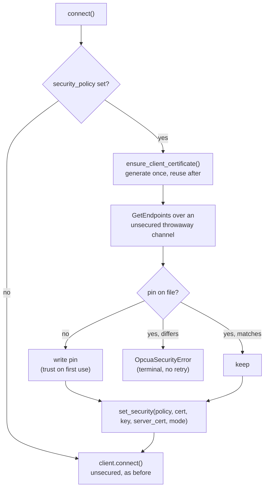
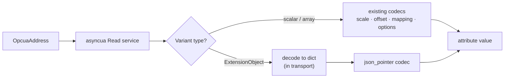
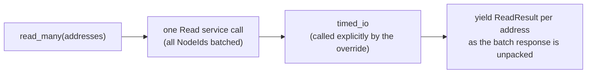

# OPC-UA transport spec

- **Status**: Draft
- **Milestone**: M1 — Pull, M3 — Secure channel
- **Issues**: AGR-981 (this spec), AGR-983 (address/config), AGR-984 (pull client), AGR-982/985 (acceptance), AGR-991 (secure channel), AGR-992 (secrets UX)
- **Out of scope**: subscriptions beyond the placeholder below (M2, AGR-987/988/989)

## Decisions

1. `OpcuaAddress` follows the `BacnetAddress` shape (`BaseModel` + `TransportAddress`), but needs no `extra_context` — an OPC-UA NodeId is self-contained, unlike a Bacnet object which needs a device instance.
2. Auth for M1 is `anonymous` or `username_password`. `password` is marked `Field(json_schema_extra={"secret": True})` from day one — the same convention as MQTT's `password` and KNX's two IP-Secure passwords — so the UI masks it immediately; there is nothing "plain" about it. AGR-992 (M3) layers the write-only API guarantee (never returned in GET/list/logs) on top of this same field — it does not introduce the masking, it hardens what's already masked.
3. Codec policy is **identity-first**: most values arrive already typed via `asyncua`, so no new codec family. ExtensionObjects decode to a `dict` in the transport and are addressed with the existing `json_pointer` codec; everything else falls through to `scale`/`offset`/`mapping`/`options` as needed. An attribute's final value is always a scalar (`int | float | str | bool`) — a dict must be reduced via `json_pointer` before it reaches the attribute layer, it is never exposed raw.
4. Write-side exact variant typing (e.g. server wants `Int16` not `Int32`) is resolved in the transport's write path, not in a codec — only the transport has the server-declared type.
5. `read_many` overrides the base concurrent fan-out — OPC-UA batches natively into one Read service call (multiple NodeIds, one request), same shape as BACnet's RPM override, not the per-address `read()` loop `TransportClient.read_many` defaults to.
6. Because that override bypasses `read()`, it must wrap its own wire transaction in `timed_io` itself (per the contract documented on `TransportClient.read_many` in `core/transports/base.py`) — otherwise the read I/O metric silently disappears for every batched read.
7. `_serialize_reads` stays `False` (the base default) — unlike BACnet's UDP/RPM stack, `asyncua`'s session multiplexes concurrent requests over one connection by request handle, so there's no need to serialize ad-hoc single reads that fall outside a batch. AGR-984's integration tests must include a concurrent-reads case to confirm this holds against the fixture server.
8. Server trust is **pin-on-first-use**, not a trust file an operator has to populate. The certificate an endpoint advertises on the first connect is written to the PKI directory and required byte-for-byte on every connect after that. A trust file would need an out-of-band copy of the server certificate before gridone could talk to anything, which no vendor GUI makes easy; pinning gets the same "a swapped certificate is refused" guarantee with no setup step. Pre-provisioning is still available to anyone who wants it, by dropping the expected certificate at the pin path before the first connect.
9. The pin is checked **before** the handshake, against the certificate the endpoint advertises, rather than being left to `set_security` to enforce during the handshake. A mismatch left to the handshake never produces an error: the server silently fails to decrypt a message sealed with the wrong public key, so the client only sees `connect_timeout` elapse — and a timeout is retryable, so the transport would reconnect against the impostor forever. Checking first turns it into a typed, terminal `OpcuaSecurityError`. The cost is one extra unsecured discovery round-trip per connect, which is per-session, not per-read.
10. The ApplicationURI and the certificate's DNS SAN are **fixed constants**, not derived from `socket.gethostname()` (asyncua's default). `setup_self_signed_certificate` regenerates the certificate whenever either stops matching, and a regenerated certificate has to be re-trusted on every server it talks to — so deriving them from the hostname would silently revoke gridone's own trust every time a container came back with a new hostname.
11. A secure-channel refusal is **terminal**: it raises `OpcuaSecurityError`, a `TerminalConnectionError`, which stops `schedule_reconnect` instead of letting it retry. The reconnect path in `core/transports/base.py` has no backoff, so a standing condition — an untrusted certificate, a policy the server does not offer — would otherwise spin at full speed indefinitely. The transport parks in an error state until `update_config` schedules a fresh attempt.
12. `Basic128Rsa15` and `Basic256` are **not offered**. The OPC Foundation withdrew both, and listing them in the config vocabulary invites a downgrade.

## `OpcuaAddress`

NodeId, in the protocol's own string notation.

| Field | Type | Description |
|---|---|---|
| `namespace_index` | `int` (`ns`) | Namespace index, e.g. `2` |
| `identifier_type` | `"i" \| "s" \| "g" \| "b"` | Numeric / String / GUID / Opaque |
| `identifier` | `int \| str` | The identifier itself |

**String form** — `ns=<index>;<type>=<value>`:

```yaml
read: "ns=2;s=Chiller.SupplyTemp"   # string identifier
read: "ns=4;i=1042"                 # numeric identifier
read: "ns=1;g=09087e75-8e5e-499b-954f-f2a9603db28a"  # GUID
read: "ns=1;b=M/RbKBsRVkePCePcx24oRA=="               # opaque, base64
```

**Namespace defaulting** — `ns=` may be omitted, defaulting to **`ns=0`** (OPC-UA's own standard/reserved namespace, per the spec — not a gridone convention): `read: "s=ServerStatus"` is equivalent to `read: "ns=0;s=ServerStatus"`. Same default applies to the dict form when `ns` is absent.

**Whitespace tolerance** — `from_str` strips surrounding whitespace around `;` and `=`, so `"ns = 2 ; s = Chiller.SupplyTemp"` parses identically to the compact form (mirrors `BacnetAddress.from_str`'s tolerance for its own separators).

**Dict form** — equivalent, explicit:

```yaml
read:
  ns: 2
  s: Chiller.SupplyTemp

read:
  s: ServerStatus   # ns omitted -> defaults to 0
```

`OpcuaAddress.id` returns the canonical `ns=..;t=..` string — this is both the value fed to `asyncua`'s `NodeId.from_string()` and (M2) the MonitoredItem topic.

## Transport config

| Field | Required | Default | Description |
|---|---|---|---|
| `endpoint_url` | yes | — | `opc.tcp://host:port/path` |
| `auth_mode` | no | `anonymous` | `anonymous` or `username_password` |
| `username` | no | — | Required if `auth_mode` is `username_password` |
| `password` | no | — | Required if `auth_mode` is `username_password`. Masked (`secret: True`), same convention as MQTT/KNX/webhook — see Decision 2 |
| `connect_timeout` | no | `10.0` | Seconds to establish the session |
| `request_timeout` | no | `5.0` | Seconds per Read/Write service call |
| `keepalive_interval` | no | `5.0` | Seconds between session keepalive pings |
| `security_policy` | no | `None` | `None`, `Basic256Sha256`, `Aes128Sha256RsaOaep` or `Aes256Sha256RsaPss` |
| `security_mode` | no | `None` | `None`, `Sign` or `SignAndEncrypt` |

```yaml
transport:
  name: chiller-opcua
  protocol: opcua
  config:
    endpoint_url: opc.tcp://10.0.1.20:4840
    auth_mode: anonymous
```

```yaml
transport:
  name: chiller-opcua-secure
  protocol: opcua
  config:
    endpoint_url: opc.tcp://10.0.1.20:4840
    auth_mode: username_password
    username: gridone
    password: the-server-password
    security_policy: Basic256Sha256
    security_mode: SignAndEncrypt
```

Config values are used exactly as written — nothing interpolates environment variables, so `${VAR}` in a password authenticates with that literal string. Sourcing secrets from outside the config arrives with AGR-992.

## Secure channel

OPC-UA's secure channel is mutual X.509 with its own handshake, not TLS. Two things are negotiated per endpoint — a security policy (the cipher suite) and a message security mode (`None`, `Sign`, `SignAndEncrypt`) — and both peers authenticate with a long-lived *application-instance certificate*. It is independent of user auth: `auth_mode` composes freely with any policy/mode pair.



### PKI directory

Everything lives under one directory, `GRIDONE_OPCUA_PKI_DIR`, defaulting to `~/.gridone/opcua-pki`:

| Path | Contents |
|---|---|
| `client_key.pem` | gridone's private key (PKCS8 PEM), generated on first use |
| `client_cert.der` | gridone's application-instance certificate (DER), valid 3 years, renewed 90 days before expiry |
| `servers/<digest>.der` | the pinned certificate for one endpoint, keyed by a SHA-256 digest of its URL |

**This directory must be persistent.** The certificate is gridone's identity, and every server an operator has trusted has trusted *that* certificate — losing it means re-doing the trust step everywhere. The container image declares no volume, so a Docker deployment has to mount one.

One certificate serves the whole instance, shared by every OPC-UA transport, so an operator trusts gridone once per server rather than once per transport. Its ApplicationURI is `urn:gridone:devices-manager:opcua-client`, present as a URI SAN and advertised on every connect; a server that finds the two disagreeing rejects the session with `BadCertificateUriInvalid`.

### Operator first-connect step

A server will not accept an unknown client certificate, and nothing gridone does client-side can change that — a human has to approve it once, server-side:

1. Configure the transport with the policy and mode the server requires and let it connect. The attempt fails, and the transport parks in an error state naming the rejection.
2. That failed attempt is what puts gridone's certificate in front of the server. Find it in the server's rejected-certificates list and move it to the trusted list. Where that lives is vendor-specific: Siemens SIMATIC exposes it in the OPC UA configuration UI, CODESYS-based controllers (including the WAGO CC100) keep it under the PLC's certificate store in the web UI, and a site running a Global Discovery Server can push the trust instead.
3. Trigger a reconnect. Only an update carrying a `config` key re-arms the transport, and at this point there is nothing to change, so the minimal request is `PATCH /transports/{id}` with body `{"config": {}}`. A name-only update returns 200 and leaves the transport parked. The session comes up.

Step 3 is required because a terminal rejection deliberately stops the retry loop, on the read path as well as the reconnect path — gridone will not keep hammering a server that has refused it, and will not re-attempt on its own.

The server's certificate is pinned the first time gridone reads it from the endpoint, during the discovery leg — which happens on the first *attempt*, before the handshake, so a first attempt that fails at step 1 has already recorded the pin.

### Rotating a server certificate

A server that renews its own certificate (a 365-day self-signed certificate expiring, a firmware update, a controller reflash) presents something that no longer matches the pin, and gridone refuses it — deliberately indistinguishable from an impostor, because at this layer the two are the same event. Accepting the new certificate means deleting the pin file named in the error message and reconnecting, which re-runs the first-use step. There is no API for this yet; it is a filesystem operation inside the PKI volume.

### Failure modes

| Condition | Surfaces as | Retried? |
|---|---|---|
| Client certificate not trusted by the server | `OpcuaSecurityError` (`BadCertificateUntrusted`) | no |
| ApplicationURI not matching the certificate SAN | `OpcuaSecurityError` (`BadCertificateUriInvalid`) | no |
| Policy or mode the server does not offer | `OpcuaSecurityError` (no matching endpoint) | no |
| Server certificate differs from the pin | `OpcuaSecurityError` | no |
| Network fault, server restart, session timeout | the existing reconnect path | yes |

## Secrets UX (AGR-992)

There is no client-private-key config field: the client identity cert/key is generated by gridone itself (see [PKI directory](#pki-directory)) and lives on disk, never in the DB or the API. So `password` (session auth) is the only secret this transport's config actually carries.

AGR-579/AGR-918 define a generalized transport-secrets mechanism (masking + preserve-on-blank owned by a `dto`/`storage` split), but both are unstarted. AGR-992 implements the same guarantee now, ahead of that split, without depending on it:

- `dto/transport_dto.py` adds `secret_field_names(config_cls)` and `mask_secrets(dto)`, driven by the existing `Field(json_schema_extra={"secret": True})` marker — the same marker MQTT/KNX/webhook already declare, so masking is generic across transports, not opcua-specific.
- Masking is applied only at the presentation edge, in `DevicesService.list_transports` / `get_transport` / `add_transport` / `update_transport` — never inside `TransportRegistry` or `core_to_dto` itself, which still feeds persistence with the real value. This sidesteps the exact conflation AGR-918 exists to fix: nothing here mutates the object handed to storage.
- Preserve-on-blank is likewise done in `DevicesService.update_transport`: a blank value for a field in `preserve_on_blank_field_names(config_cls)` is dropped from the PATCH patch dict before it reaches `TransportClient.update_config`'s merge, so the stored value survives. A patch reduced to nothing by this filtering is normalized back to `None`, not `{}`, so it doesn't spuriously trigger a reconnect or device restart.
- `preserve_on_blank_field_names` is `secret_field_names` minus a config class's `PRESERVE_ON_BLANK_EXEMPT` — a `ClassVar`, not a `Field`, so it stays out of the public JSON schema (the form-schema dialect guardrail rejects unknown `json_schema_extra` keywords, and this has no UI meaning). KNX's two IP-Secure passwords are exempt: blank already means "disable IP-Secure" there (`KNXTransportConfig._blank_password_means_absent`, predates AGR-992), so the generic preserve-on-blank rule must not shadow it. They are still masked on read like any other secret — only the update-time preserve behavior differs.

When AGR-918 lands, this logic is expected to move into `to_public`/`resolve_update` as designed there; nothing here is opcua-specific enough to block that migration.

## Codec policy



Decode runs top-to-bottom on read, bottom-to-top on write, same as every other transport. `json_pointer`/`bit`/`slice` stay identity on encode — no change from existing behavior.

```yaml
attributes:
  - name: supply_temperature
    data_type: float
    read: "ns=2;s=Chiller.SupplyTemp"

  - name: setpoint
    data_type: float
    read_write: "ns=2;s=Chiller.Setpoint"

  - name: compressor_status
    data_type: str
    read: "ns=4;i=1042"          # ExtensionObject
    codecs:
      - json_pointer: /status/code
```

## Read batching



`OpcuaTransportClient` overrides `read_many` the same way `BacnetTransportClient` overrides it for RPM: one wire call for the whole batch, not the base class's per-address `read()` fan-out. Two obligations come with that override (both spelled out on `TransportClient.read_many` in `core/transports/base.py`):

- it must call `timed_io` itself around the batched request — bypassing `read()` means the base class's own `timed_io` call never fires;
- `_serialize_reads` stays `False`, since batching already collapses N addresses into one request and `asyncua` handles any remaining concurrent single reads by request handle over the same session, unlike BACnet's stack.

## Test strategy

| Harness | Level | Covers |
|---|---|---|
| In-process `asyncua` server (pytest fixture) | Integration (AGR-984) | Real protocol round-trips for every scalar/array data type, both NodeId forms, against a controlled fixture — fast loop, no external deps |
| `opc-plc` Docker (`mcr.microsoft.com/iotedge/opc-plc`) | Acceptance (AGR-982) | End-to-end golden path through the API, deterministic node set, mirrors the existing http/modbus acceptance legs |
| In-process `asyncua` server with a certificate + `CertificateValidator` | Integration (AGR-991) | Every policy × mode pair round-tripping, pin-on-first-use and pin mismatch, and each rejection in the table above landing as a terminal typed error |
