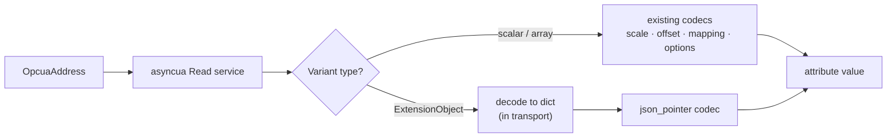
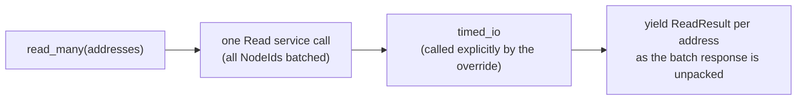

# OPC-UA transport spec

- **Status**: Draft
- **Milestone**: M1 — Pull
- **Issues**: AGR-981 (this spec), AGR-983 (address/config), AGR-984 (pull client), AGR-982/985 (acceptance)
- **Out of scope**: certificate/Sign&Encrypt security (M3, AGR-991/992), subscriptions beyond the placeholder below (M2, AGR-987/988/989)

## Decisions

1. `OpcuaAddress` follows the `BacnetAddress` shape (`BaseModel` + `TransportAddress`), but needs no `extra_context` — an OPC-UA NodeId is self-contained, unlike a Bacnet object which needs a device instance.
2. Auth for M1 is `anonymous` or `username_password`. `password` is marked `Field(json_schema_extra={"secret": True})` from day one — the same convention as MQTT's `password` and KNX's two IP-Secure passwords — so the UI masks it immediately; there is nothing "plain" about it. AGR-992 (M3) layers the write-only API guarantee (never returned in GET/list/logs) on top of this same field — it does not introduce the masking, it hardens what's already masked.
3. Codec policy is **identity-first**: most values arrive already typed via `asyncua`, so no new codec family. ExtensionObjects decode to a `dict` in the transport and are addressed with the existing `json_pointer` codec; everything else falls through to `scale`/`offset`/`mapping`/`options` as needed. An attribute's final value is always a scalar (`int | float | str | bool`) — a dict must be reduced via `json_pointer` before it reaches the attribute layer, it is never exposed raw.
4. Write-side exact variant typing (e.g. server wants `Int16` not `Int32`) is resolved in the transport's write path, not in a codec — only the transport has the server-declared type.
5. `read_many` overrides the base concurrent fan-out — OPC-UA batches natively into one Read service call (multiple NodeIds, one request), same shape as BACnet's RPM override, not the per-address `read()` loop `TransportClient.read_many` defaults to.
6. Because that override bypasses `read()`, it must wrap its own wire transaction in `timed_io` itself (per the contract documented on `TransportClient.read_many` in `core/transports/base.py`) — otherwise the read I/O metric silently disappears for every batched read.
7. `_serialize_reads` stays `False` (the base default) — unlike BACnet's UDP/RPM stack, `asyncua`'s session multiplexes concurrent requests over one connection by request handle, so there's no need to serialize ad-hoc single reads that fall outside a batch. AGR-984's integration tests must include a concurrent-reads case to confirm this holds against the fixture server.

## `OpcuaAddress`

NodeId, in the protocol's own string notation.

| Field | Type | Description |
|---|---|---|
| `namespace_index` | `int` (`ns`) | Namespace index, e.g. `2` |
| `identifier_type` | `"i" \| "s" \| "g" \| "b"` | Numeric / String / GUID / Opaque |
| `identifier` | `int \| str` | The identifier itself |

**String form** — `ns=<index>;<type>=<value>`:

```yaml
read: "ns=2;s=Chiller.SupplyTemp"   # string identifier
read: "ns=4;i=1042"                 # numeric identifier
read: "ns=1;g=09087e75-8e5e-499b-954f-f2a9603db28a"  # GUID
read: "ns=1;b=M/RbKBsRVkePCePcx24oRA=="               # opaque, base64
```

**Namespace defaulting** — `ns=` may be omitted, defaulting to **`ns=0`** (OPC-UA's own standard/reserved namespace, per the spec — not a gridone convention): `read: "s=ServerStatus"` is equivalent to `read: "ns=0;s=ServerStatus"`. Same default applies to the dict form when `ns` is absent.

**Whitespace tolerance** — `from_str` strips surrounding whitespace around `;` and `=`, so `"ns = 2 ; s = Chiller.SupplyTemp"` parses identically to the compact form (mirrors `BacnetAddress.from_str`'s tolerance for its own separators).

**Dict form** — equivalent, explicit:

```yaml
read:
  ns: 2
  s: Chiller.SupplyTemp

read:
  s: ServerStatus   # ns omitted -> defaults to 0
```

`OpcuaAddress.id` returns the canonical `ns=..;t=..` string — this is both the value fed to `asyncua`'s `NodeId.from_string()` and (M2) the MonitoredItem topic.

## Transport config

| Field | Required | Default | Description |
|---|---|---|---|
| `endpoint_url` | yes | — | `opc.tcp://host:port/path` |
| `auth_mode` | no | `anonymous` | `anonymous` or `username_password` |
| `username` | no | — | Required if `auth_mode` is `username_password` |
| `password` | no | — | Required if `auth_mode` is `username_password`. Masked (`secret: True`), same convention as MQTT/KNX/webhook — see Decision 2 |
| `connect_timeout` | no | `10.0` | Seconds to establish the session |
| `request_timeout` | no | `5.0` | Seconds per Read/Write service call |
| `keepalive_interval` | no | `5.0` | Seconds between session keepalive pings |

```yaml
transport:
  name: chiller-opcua
  protocol: opcua
  config:
    endpoint_url: opc.tcp://10.0.1.20:4840
    auth_mode: anonymous
```

## Codec policy



Decode runs top-to-bottom on read, bottom-to-top on write, same as every other transport. `json_pointer`/`bit`/`slice` stay identity on encode — no change from existing behavior.

```yaml
attributes:
  - name: supply_temperature
    data_type: float
    read: "ns=2;s=Chiller.SupplyTemp"

  - name: setpoint
    data_type: float
    read_write: "ns=2;s=Chiller.Setpoint"

  - name: compressor_status
    data_type: str
    read: "ns=4;i=1042"          # ExtensionObject
    codecs:
      - json_pointer: /status/code
```

## Read batching



`OpcuaTransportClient` overrides `read_many` the same way `BacnetTransportClient` overrides it for RPM: one wire call for the whole batch, not the base class's per-address `read()` fan-out. Two obligations come with that override (both spelled out on `TransportClient.read_many` in `core/transports/base.py`):

- it must call `timed_io` itself around the batched request — bypassing `read()` means the base class's own `timed_io` call never fires;
- `_serialize_reads` stays `False`, since batching already collapses N addresses into one request and `asyncua` handles any remaining concurrent single reads by request handle over the same session, unlike BACnet's stack.

## Test strategy

| Harness | Level | Covers |
|---|---|---|
| In-process `asyncua` server (pytest fixture) | Integration (AGR-984) | Real protocol round-trips for every scalar/array data type, both NodeId forms, against a controlled fixture — fast loop, no external deps |
| `opc-plc` Docker (`mcr.microsoft.com/iotedge/opc-plc`) | Acceptance (AGR-982) | End-to-end golden path through the API, deterministic node set, mirrors the existing http/modbus acceptance legs |
