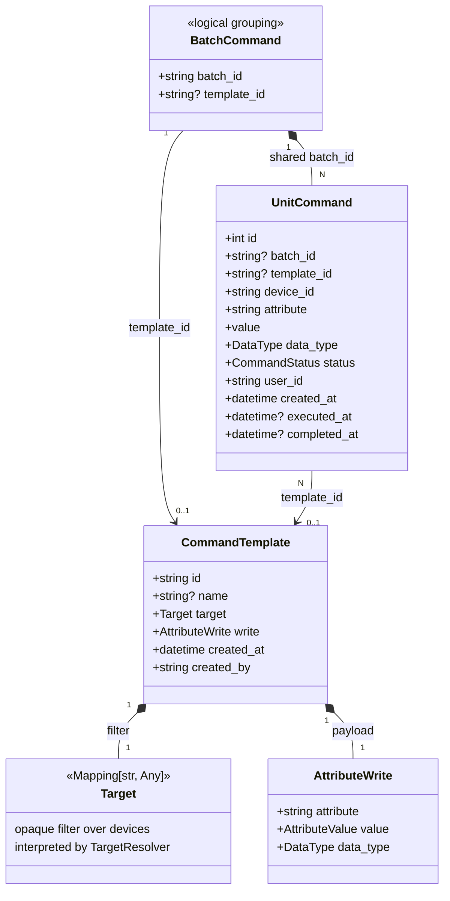

# Gridone Commands

`gridone-commands` is the dispatch and lifecycle layer for **writes to device attributes**. Clients (UI, CLI, automation engine) call into `CommandsService`; every write lands in `unit_commands` with a status you can poll.

The package intentionally knows nothing about devices_manager or assets — it talks to them through injected `Protocol`s (`DeviceWriter`, `TargetResolver`, `CommandResultHandler`) so it can be reused under any controller.

## Data model



### Unit, batch, template — who holds what

- **`UnitCommand`** is the only thing that is actually executed. One row per `(device_id, attribute)` write, with a lifecycle: `PENDING → SUCCESS | ERROR`. The writer absorbs exceptions and records `status_details`; callers never need `try/except`.
- **`BatchCommand`** is not a table. It is the set of `unit_commands` that share a `batch_id`. One dispatch = one `batch_id` stamped on N unit rows. A summary DTO (`BatchCommand.from_unit_commands`) rehydrates the idea when needed for API responses.
- **`CommandTemplate`** is the reusable `(target, write)` description. Saved templates (with a `name`) are what automations and the UI point at. Ephemeral templates (`name IS NULL`) are auto-created for every ad-hoc batch dispatch so the target survives for audit.
- **`Target`** is an opaque `Mapping[str, Any]` from this package's point of view. The composition-root `TargetResolver` interprets it (today by forwarding the keys to `DevicesManager.list_devices`) and returns the list of matched device ids at dispatch time.
- **`AttributeWrite`** groups `(attribute, value, data_type)` so every dispatcher takes it as one object instead of three kwargs.

## Dispatch entry points

```mermaid
flowchart TD
    UI[UI / CLI / automation]

    UI -->|"POST /devices/:device_id/commands"| DU["dispatch_unit(device_id, write)"]
    UI -->|"POST /devices/commands"| DB["dispatch_batch(target, write)"]
    UI -->|"POST /devices/command-templates/:template_id/dispatch"| DFT["dispatch_from_template(template_id)"]

    DU --> UC1["1 UnitCommand&#10;(no template)"]
    DB --> EPH[(ephemeral CommandTemplate&#10;name = NULL)]
    EPH --> CORE
    DFT -->|"get_template&#10;raises if name IS NULL"| SAVED[(saved CommandTemplate&#10;name IS NOT NULL)]
    SAVED --> CORE

    CORE["_dispatch_template&#10;resolve target &#8594; write N units"]
    CORE --> RES["TargetResolver.resolve(target)"]
    RES --> UCN["N UnitCommands&#10;(shared batch_id, same template_id)"]
```



- `dispatch_unit` is the direct single-device path. No template, no resolver — a thermostat click goes straight to the writer.
- `dispatch_batch` always creates an ephemeral template first, then falls through `_dispatch_template`. This guarantees every batch has an audit trail of what filter it ran against.
- `dispatch_from_template` is the "run a saved workflow" path; it refuses ephemeral ids so a user can't accidentally re-dispatch internal audit rows by guessing a key.

## `name` — the only signal that distinguishes saved from ephemeral

Templates are a single table. What makes a row "a saved template" vs "the audit record of a past batch dispatch" is whether it has a `name`:

| `name` value      | What the row means                       | Visible via `GET /devices/command-templates/` | Dispatchable by id         |
| ----------------- | ---------------------------------------- | --------------------------------------------- | -------------------------- |
| `NOT NULL`        | User-saved template                      | yes                                           | yes                        |
| `NULL` (ephemeral) | Audit snapshot of an ad-hoc batch        | no (filtered out)                             | no (`dispatch_from_template` raises 404) |

Deleting a saved template **demotes it** — `UPDATE command_templates SET name = NULL WHERE id = $1`. The row survives so historical `unit_commands` keep their `template_id` pointer. A later cleanup job reaps stale ephemerals; the `ON DELETE SET NULL` cascade on `unit_commands.template_id` detaches history cleanly at that point.

Why one table instead of two: `(target, write, created_at, created_by)` is the same data whether the row is saved or just-dispatched audit; splitting would duplicate the columns and the serialization code. The nullable `name` is the full delta.

## Storage

`CommandsStorage` (protocol) handles both unit commands and templates. Two backends today:

- **`MemoryStorage`** — in-process dict + list. Default when no URL is passed. Used by tests and any composition that wants to keep commands out of the database.
- **`PostgresCommandsStorage`** — asyncpg pool, yoyo migrations under `storage/postgres/migrations/`. Registers a jsonb type codec so `target` / `write` round-trip as Python dicts.

### Factory

```python
storage = await build_storage(url)              # url is None      → MemoryStorage
storage = await build_storage("postgresql://…")  # url is postgresql → PostgresCommandsStorage
```

The factory only knows "postgres or memory." All asyncpg / json / yoyo imports live inside `commands.storage.postgres`, so a memory-only deployment never loads them.

### Schema (postgres)

- `unit_commands` — the execution records. `batch_id` groups a batch dispatch; `template_id` (nullable) links to the template the batch was resolved from. Cross-service FK from `ts_data_points.command_id` is preserved through the rename/alter history.
- `command_templates` — `(id, name, target jsonb, write jsonb, created_at, created_by)`. Partial index on `name WHERE name IS NOT NULL` keeps the saved-templates list endpoint fast even as ephemerals accumulate.

Migrations live under `storage/postgres/migrations/`; current head is `0004.add-command-templates.sql`.

## Architectural notes

- **Protocols, not imports.** `CommandsService` constructor takes:
  - `DeviceWriter` — how to push a value onto a device
  - `CommandResultHandler` — what to do after a successful write (the composition root wires this to the timeseries service so successful writes land as data points)
  - `TargetResolver` — how to turn a `Target` into `list[str]` of device ids
  - `CommandsStorage` — persistence
  Commands imports nothing from `devices_manager` or `assets`.
- **Absorb, don't raise.** Writer exceptions become `CommandStatus.ERROR` with `status_details`. Batch dispatches return their PENDING rows immediately and run writes in a background task; callers poll by `batch_id`.
- **16-hex ids everywhere.** `uuid4().hex[:16]` for `batch_id` and `CommandTemplate.id`. Short, URL-friendly, plenty of collision resistance.
- **Ubiquitous language.** `dispatch_unit`, `dispatch_batch`, `dispatch_from_template` — three verbs, one noun (`UnitCommand`). No legacy `group_id` or "run" terminology.
