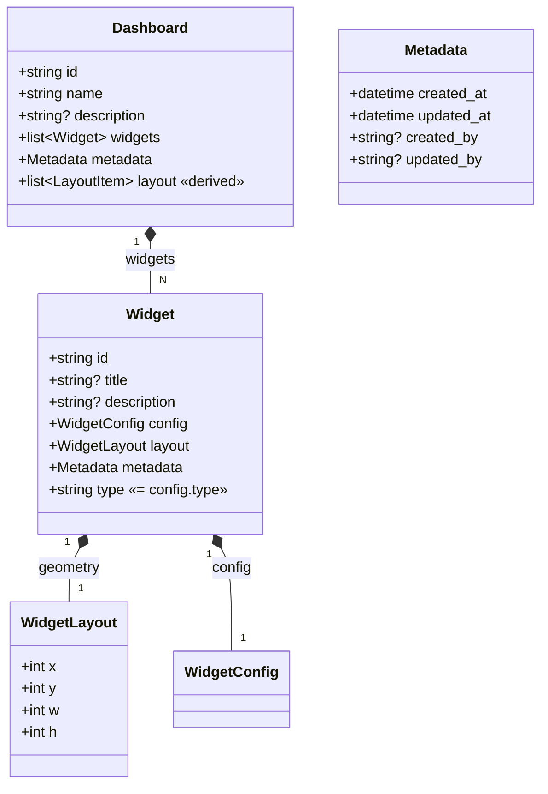

# Gridone Dashboards

`gridone-dashboards` is the UI-oriented service that owns **dashboard documents** and the **registry of widget types** that render on them. It is the only package whose domain is the UI: everything else stays headless, and this package turns building data into a layout the frontend draws.

Clients (UI, CLI, later MCP) call `DashboardsService`. A dashboard is a container with some metadata plus a list of widgets; every widget has a common envelope (`title`, `description`, metadata) and a per-type `config`.

## Data model



### Geometry lives on the widget

react-grid-layout drives one `layout` array of `{i, x, y, w, h}` per grid. We do **not** store that array separately: each widget owns its geometry (`WidgetLayout`), and `Dashboard.layout` is a **projection** —

```python
dashboard.layout == [LayoutItem(i=w.id, **w.layout) for w in dashboard.widgets]
```

This makes two invariants free instead of enforced-on-every-write:

- exactly one layout item per widget,
- removing a widget removes its layout item.

`update_layout(items)` is still a first-class operation — it writes each item's geometry back onto its widget, requiring an exact bijection between items and widgets (single flat layout; responsive breakpoints are a later, clean expand).

### Widgets are a registry

`WidgetRegistry` is the single source of truth for widget config schemas. Each `WidgetType` binds a `type` discriminator to a pydantic config model and a default grid size. The registry:

- **validates** raw config into the right model (`validate_config`),
- hands out each type's **default size** for placement,
- exposes the per-type **JSON Schemas** (`widget_schemas()` → `model_json_schema()`), which UI forms inherit via `z.fromJSONSchema`.

The backend is the source of truth for widget config — `config` is a discriminated union on `type`, and `type` is **immutable** after creation (changing type = remove + add).

Today one type is registered: **`text`** — `{type: "text", text: str, color: str}` where `color` is a hex color (`#RRGGBB`, pattern-validated so the constraint flows into the JSON Schema). It is a deliberately trivial placeholder for the first layout UI demo.

## Public API

```python
service = DashboardsService(storage_url)   # None → in-memory backend
await service.start()

# dashboards
d   = await service.create(DashboardCreate(name="Ops"))
d   = await service.get(d.id)
page = await service.list()                                  # summaries only
d   = await service.update(d.id, DashboardPatch(name="Ops 2"))
await service.delete(d.id)

# widgets (config carries `type`)
w = await service.add_widget(d.id, config={"type": "text", "text": "hi", "color": "#1a2b3c"})
w = await service.update_widget(d.id, w.id, WidgetPatch(title="Note"))
await service.remove_widget(d.id, w.id)
d = await service.update_layout(d.id, [LayoutItem(i=w.id, x=0, y=0, w=4, h=2)])

schemas = service.widget_schemas()                           # {type: JSON Schema}
await service.stop()
```

`list()` returns `DashboardSummary` (id, name, description, metadata) — no widgets or layout; those are only on `get(id)`.

## Storage

`DashboardsStorage` (protocol) round-trips whole `Dashboard` aggregates. Two backends:

- **`MemoryStorage`** — in-process dict; default when no URL is passed. Deep-copies on read/write, which also preserves each widget's concrete config subclass.
- **`PostgresDashboardsStorage`** — asyncpg pool, yoyo migrations under `storage/postgres/migrations/`. Dashboards are stored **document-oriented**: one row per dashboard, widgets (with geometry + metadata) in a `widgets` JSONB list. The registry rebuilds each widget's concrete config on read.

```python
storage = await build_storage(url, registry)   # None → MemoryStorage, postgresql:// → Postgres
```

All business logic lives in the service; storage just stores and returns aggregates.

## Architectural notes

- **Service shape.** Follows `models.service.Service`: `__init__(storage_url, registry=None)`, `async start` / `async stop`. Unsupported URL schemes raise `UnsupportedStorageError`; backend failures raise `StorageConnectionError`.
- **No controller framework.** No FastAPI here — the HTTP layer lives in `packages/api` and wraps this service.
- **16-hex ids** via `models.ids.gen_id()` for dashboards and widgets.
- **Metadata** (AGR-933): `created_at` / `updated_at` are stamped by the service; `created_by` / `updated_by` are reserved (nullable) until caller identity is threaded through.
