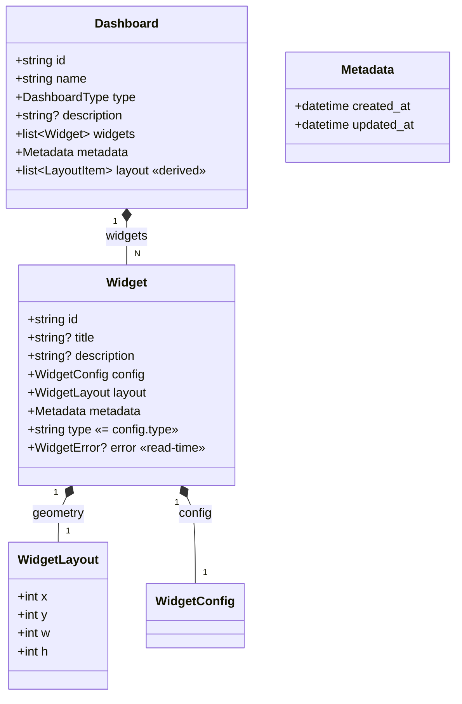

# Gridone Dashboards

`gridone-dashboards` is the UI-oriented service that owns **dashboard documents** and the **registry of widget types** that render on them. It is the only package whose domain is the UI: everything else stays headless, and this package turns building data into a layout the frontend draws.

Clients (UI, CLI, later MCP) call `DashboardsService`. A dashboard is a container with some metadata plus a list of widgets; every widget has a common envelope (`title`, `description`, metadata) and a per-type `config`.

## Data model


```mermaid
classDiagram
    class Dashboard {
        +string id
        +string name
        +DashboardType type
        +string? description
        +list~Widget~ widgets
        +Metadata metadata
        +list~LayoutItem~ layout  «derived»
    }

    class Widget {
        +string id
        +string? title
        +string? description
        +WidgetConfig config
        +WidgetLayout layout
        +Metadata metadata
        +string type  «= config.type»
        +WidgetError? error  «read-time»
    }

    class WidgetLayout {
        +int x
        +int y
        +int w
        +int h
    }

    class Metadata {
        +datetime created_at
        +datetime updated_at
    }

    Dashboard "1" *-- "N" Widget : widgets
    Widget "1" *-- "1" WidgetLayout : geometry
    Widget "1" *-- "1" WidgetConfig : config
```

### Geometry lives on the widget

react-grid-layout drives one `layout` array of `{i, x, y, w, h}` per grid. We do **not** store that array separately: each widget owns its geometry (`WidgetLayout`), and `Dashboard.layout` is a **projection** —

```python
dashboard.layout == [LayoutItem(i=w.id, **w.layout) for w in dashboard.widgets]
```

This makes two invariants free instead of enforced-on-every-write:

- exactly one layout item per widget,
- removing a widget removes its layout item.

`update_layout(items)` is still a first-class operation — it writes each item's geometry back onto its widget, requiring an exact bijection between items and widgets (single flat layout; responsive breakpoints are a later, clean expand).

### A dashboard has a type

`type` is `live` or `history` (`dashboards.types.DashboardType`), chosen at creation and **immutable**: a live dashboard shows the present (device cache, live aggregates); a history one reads timeseries over a viewing period that the UI owns and never stores. Each widget type declares which dashboard types it fits, so the type decides what a dashboard may hold — adding a widget that does not fit is an `InvalidError`.

### Widgets are a registry

`WidgetRegistry` is the single source of truth for widget config schemas. Each `WidgetType` binds a `type` discriminator to a pydantic config model, a default grid size and the dashboard types it fits. The registry:

- **validates** raw config into the right model (`validate_config`),
- **loads** stored config leniently (`load_config`): a document the registry no longer accepts comes back as `InvalidWidgetConfig`, verbatim, instead of failing the dashboard,
- answers whether a type **fits** a dashboard type (`accepts`),
- hands out each type's **default size** for placement,
- exposes the per-type **JSON Schemas** (`widget_schemas()` → `model_json_schema()`), which UI forms inherit via `z.fromJSONSchema`, with the size under `x-default-size` and the fit under `x-dashboard-types`.

The backend is the source of truth for widget config — `config` is a discriminated union on `type`, and `type` is **immutable** after creation (changing type = remove + add).

Built-in types and their fit:

| type | fits | reads |
|---|---|---|
| `text` | live, history | nothing |
| `device_control`, `control_panel`, `synoptic`, `kpi_live` | live | the present |
| `chart`, `meter_tree`, `kpi_history` | history | the viewing period |

### One broken widget never fails the dashboard

Reads flag, they do not raise. On `get` (and after every write) each widget carries `error`: `invalid_config` when its stored config is an `InvalidWidgetConfig` (a type or shape this build dropped), `incompatible_type` when its type no longer fits the dashboard's. The widget keeps its cell and raw config, so it still renders as an error tile, can be laid out, renamed and removed; reconfiguring it is refused until it sits on a fitting dashboard. `error` is computed, never stored.

The **`synoptic`** widget stores `{type: "synoptic", synoptic_id: str}` and starts at 6×6 grid cells. The UI selects a stored synoptic by name and displays its live readings in read-only mode, with pan, zoom and fit controls. The dashboard period does not apply. The document reference stays opaque to the dashboards service; an unavailable document is reported within its widget. Synoptics are managed under **Configuration → Synoptics**.

## Public API

```python
service = DashboardsService(storage_url)   # None → in-memory backend
await service.start()

# dashboards
d   = await service.create(DashboardCreate(type="live", name="Ops"))
d   = await service.get(d.id)
page = await service.list()                                  # summaries only
d   = await service.update(d.id, DashboardPatch(name="Ops 2"))
await service.delete(d.id)
await service.reorder(ids)                                   # display order, every id once

# widgets (config carries `type`)
w = await service.add_widget(d.id, config={"type": "text", "text": "hi", "color": "#1a2b3c"})
w = await service.update_widget(d.id, w.id, WidgetPatch(title="Note"))
await service.remove_widget(d.id, w.id)
d = await service.update_layout(d.id, [LayoutItem(i=w.id, x=0, y=0, w=4, h=2)])

schemas = service.widget_schemas()                           # {type: JSON Schema}
await service.stop()
```

`list()` returns `DashboardSummary` (id, name, type, description, icon, metadata) — no widgets or layout; those are only on `get(id)`.

A dashboard may carry an `icon`: one key of `DASHBOARD_ICONS` (a closed vocabulary named by what the icon shows — `thermometer`, `droplets`, `fan`, ...), or `None`. The models reject any other key at the field, so a stored dashboard never names an icon the UI cannot draw; the UI owns the drawing.

Dashboards have one **display order**, shared by every user: `list()` returns it, `reorder(ids)` replaces it (every id exactly once, else `InvalidError`), a new dashboard goes last and deleting one leaves the rest in place. The order is owned by the storage, not a field of the aggregate.

## Storage

`DashboardsStorage` (protocol) round-trips whole `Dashboard` aggregates. Two backends:

- **`MemoryStorage`** — in-process dict; default when no URL is passed. Deep-copies on read/write, which also preserves each widget's concrete config subclass.
- **`PostgresDashboardsStorage`** — asyncpg pool, yoyo migrations under `storage/postgres/migrations/`. Dashboards are stored **document-oriented**: one row per dashboard, widgets (with geometry + metadata) in a `widgets` JSONB list. The registry rebuilds each widget's concrete config on read.

```python
storage = await build_storage(url, registry)   # None → MemoryStorage, postgresql:// → Postgres
```

All business logic lives in the service; storage just stores and returns aggregates.

## Architectural notes

- **Service shape.** Follows `models.service.Service`: `__init__(storage_url, registry=None)`, `async start` / `async stop`. Unsupported URL schemes raise `UnsupportedStorageError`; backend failures raise `StorageConnectionError`.
- **No controller framework.** No FastAPI here — the HTTP layer lives in `packages/api` and wraps this service.
- **16-hex ids** via `models.ids.gen_id()` for dashboards and widgets.
- **Metadata** (AGR-933): `created_at` / `updated_at` are self-defaulting on the `Metadata` model; the service bumps `updated_at` on each mutation. User attribution (`created_by` / `updated_by`) was dropped from AGR-933's scope.
