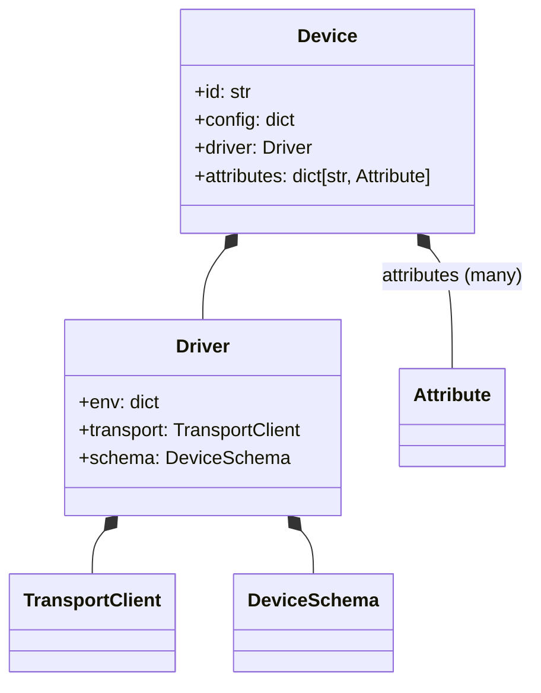

# Gridone Core

Core package includes all the necessary utilities to manage devices.
- devices
- drivers
- transports

## Structure

## Package layout

Package follows a standard `src` layout and unit tests are located in the `tests` directory.

## Class diagram

