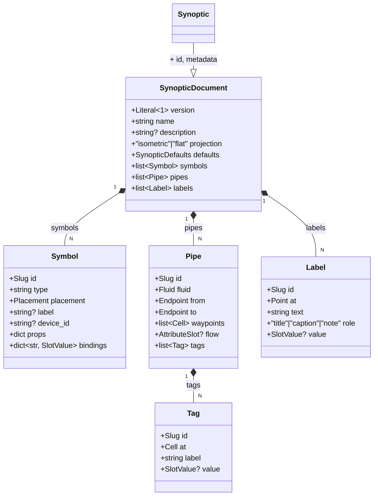

# Gridone Synoptics

`gridone-synoptics` owns **synoptic documents**: stored, live-bound diagrams of an installation. A plate says which equipment sits where on an isometric grid, how the pipes run between them, and which device value each part of the drawing shows.

The package draws nothing. It validates and persists the description; the renderer derives a drawing from it.

The format is specified in [`docs/specs/synoptic-document.md`](../../docs/specs/synoptic-document.md), and [`docs/specs/synoptic/ecs-est.json`](../../docs/specs/synoptic/ecs-est.json) is a complete plate written in it.

## The store holds the description, never a rendering

No SVG, no CSS, no renderer DSL in the database. A drawing is always derivable from the description; the description is not recoverable from a drawing, because a layout engine's positions do not exist in that direction. So the document has no `style`, `color`, `width`, `dashed` or `z_index` field anywhere, and no screen coordinates: positions are integer grid cells, and draw order is derived from them.

## Data model



`SynopticDocument` is what an author writes and what `create` / `replace` take. `Synoptic` adds the service-assigned `id` and `metadata`.

### Bindings reuse `AttributeTarget`

A slot value is either an `attribute` (a live value: an `AttributeTarget`, plus `unit`, `decimals`, `labels` and `stale_after`) or a literal `text`. A pipe's `flow` is the one place narrowed to the `attribute` arm alone: a literal has nothing to resolve, so a `text` flow would reach production as a run that silently never animates. `AttributeTarget` is `models.targets.AttributeTarget` unchanged, the same primitive chart widgets, group commands and automations point at. Nothing new is invented for pointing at data.

Bindings are a generic `{slot: SlotValue}` map rather than a per-type config model, because four consumers must enumerate every binding on a plate without knowing symbol types: save-time resolution, the live subscription, the view-scoped fault list, and the editor's binding picker.

### Cells, ports and runs

- `Cell {x, y, z}` is an integer grid cell. A pipe that climbs over a tank needs a `z`; a `flat` plate is the same document with every `z` at 0.
- A **port** is a cell offset plus the face a pipe leaves through, declared by the symbol type. The instance's `rotation` (quarter turns counter-clockwise about the origin cell) turns both.
- A pipe's polyline is `from`-cell, waypoints, `to`-cell, all segments axis-aligned. Tags and inline symbols sit at cells the run *passes through*, not only the authored corners.
- An endpoint is a symbol port, a free cell, or **a cell on another pipe**. That last one is a tee, so no junction symbol type is needed.

### Symbols are a registry

`SymbolRegistry` binds a type name to its footprint, ports, binding slots, inline capability and `props` model. `symbol_schemas()` publishes a JSON Schema per type, carrying the rest of the contract under `x-footprint`, `x-ports`, `x-slots`, `x-required-slots` and `x-inline`, so the kit and the editor read one definition instead of restating it.

The **collector** is the one type whose shape is authored per instance (`props.axis`, `props.length`, and a port offset along the bar), because a bar serving three departures is not the same shape as one serving eight. Its `rotation` must be 0, since `props.axis` already says which way the bar runs.

## Public API

```python
service = SynopticsService(storage_url, target_resolver)   # None → in-memory backend
await service.start()

plate    = SynopticDocument.model_validate(json.loads(path.read_text()))
synoptic = await service.create(plate)
synoptic = await service.get(synoptic.id)
page     = await service.list()                       # summaries only
synoptic = await service.replace(synoptic.id, plate)  # whole document
await service.delete(synoptic.id)

schemas = service.symbol_schemas()                    # {type: JSON Schema}
await service.stop()
```

A plate is written whole and read whole. There are no per-element operations: every save-time rule spans the document, so validating a fragment would mean loading the rest anyway.

Because an edit is whole and can take a while, two authors can overlap. `replace` takes `expected_updated_at`, the `updated_at` the author read; if the plate has been written since, the save is refused with a `ConflictError` instead of erasing the other author's work. It is optional here for programmatic callers and required on the HTTP route, so every save through the API carries the guard. The service compares it with the plate it just read and refuses a stale save before validating anything, so no binding is resolved for a save that cannot land; the storage then conditions the write on the row still carrying that timestamp, so a save landing between the service's read and its write is caught as well.

## Save-time rules

`validate_document` (document rules) and `validate_for_save` (document and binding rules) collect **every** violation and raises one `SchemaValidationError` carrying `{loc, msg, type}` items, so an author fixing a thirty-four pipe plate gets the whole list rather than one error per attempt. Every `type` is a member of `Violation`, the one definition of the vocabulary an editor branches on: `duplicate_id`, `unknown_symbol_type`, `invalid_props`, `unknown_slot`, `missing_slot`, `rotation_locked`, `port_off_grid`, `unknown_symbol`, `unusable_symbol`, `unknown_port`, `zero_length_segment`, `diagonal_segment`, `polyline_budget_exceeded`, `port_side_mismatch`, `off_polyline`, `self_reference`, `unknown_pipe`, `unusable_pipe`, `reference_cycle`, `not_inline_capable`, `inline_on_endpoint`, `flat_depth`, `binding_budget_exceeded`, `unresolved_target`, `ambiguous_target`, `flow_not_bool`, `decimals_not_numeric`. Messages may be reworded; these values are the contract.

| Rule | Enforced by |
|---|---|
| `version` is 1; ids match the slug pattern; `rotation` in 0..3; `fluid` in the vocabulary; coordinates within `MAX_COORDINATE`; at most `MAX_WAYPOINTS` corners per run; no NUL character anywhere in the document | the models |
| `type` is registered; `props` validate; every binding key is a declared slot; required slots are bound; a collector's `rotation` is 0 | the registry |
| ids unique across symbols, pipes, tags and labels (one namespace) | `validation` |
| a symbol's ports land on the grid | `validation` |
| a port endpoint names an existing symbol and a port it has | `validation` |
| a tee names another pipe and a cell on its run; no reference cycle | `validation` |
| segments axis-aligned, at least two distinct cells, ports entered and left through their face | `validation` |
| all runs together cross at most `MAX_POLYLINE_CELLS` cells, checked before any run is expanded | `validation` |
| an inline symbol is an inline-capable type at a cell strictly inside a run | `validation` |
| tags sit on their pipe's run | `validation` |
| `projection: "flat"` implies every `z` is 0 | `validation` |

One rule of the spec needs a `models.targets.TargetResolver`: that a binding resolves to exactly one device. Building a resolver is composition work, so the service takes one at construction and the API layer passes its own. On every `create` and `replace`, `validate_for_save()` runs the document rules above and then resolves each slot `bound_slots()` enumerates, reporting every violation (no device, several devices, a non-bool behind `flow`, `decimals` on a non-numeric attribute) at its `loc` in the same `{loc, msg, type}` list as the document rules, so an author gets one error for the whole plate. Resolution walks the fleet once per target, so a document may bind at most `MAX_BOUND_SLOTS` slots, checked before anything is resolved, and a target shared by several slots is resolved once.

What is deliberately not a rule: pipes may share cells. A tee shares one by construction, and two runs crossing at different `z` share an xy.

## Storage

`SynopticsStorage` (protocol) round-trips whole `Synoptic` aggregates. Two backends:

- **`MemoryStorage`**: in-process dict, default when no URL is passed; deep-copies on read and write.
- **`PostgresSynopticsStorage`**: asyncpg pool, yoyo migrations under `storage/postgres/migrations/`. One row per plate, the whole authored document in a `document` JSONB column. The envelope an index needs (`name`, `description`, `projection`) is read out of the JSONB rather than copied into columns, so it cannot drift from the plate it describes.

`props` stays a plain mapping on the model, validated against the type on save, so reading a row back needs no registry.

## Architectural notes

- **Service shape.** Follows `models.service.Service`: `__init__(storage_url, target_resolver, registry=None)`, `async start` / `async stop`. Unsupported URL schemes raise `UnsupportedStorageError`; backend failures raise `StorageConnectionError`.
- **No controller framework.** No FastAPI here; the HTTP layer lives in `packages/api`.
- **16-hex ids** via `models.ids.gen_id()` for the document. Element ids are author-chosen slugs: pipes reference symbols by id, and `pac-03` reviews better than a hex string.
- **Text is literal, not i18n keys.** A plate is authored for one customer, in that customer's language.
